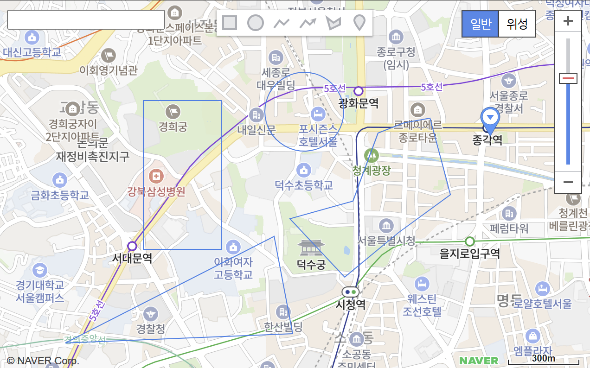

# Naver Map & Drawing Manager 길라잡이

이번에는 네이버 map API에서 KVO 이벤트를 상속받아 React에서 지도를 Custom하게 사용하는 방법에 대해 정리하고자 한다. 먼저 기본적인 사용방법은 이 [공식문서](https://navermaps.github.io/maps.js.ncp/docs/index.html)를 참조하자. [아티클의 마지막에 실제 컴포넌트를 랜더링 해놓았다.](#specific_content) 이번에 다루는 네이버 지도와 드로잉 매니저 기능들을 적용해놓았으니 확인 후 글을 마저 읽어도 좋다.

#### 1. Naver 지도 연결하기

네이버 지도를 본인의 웹페이지에서 로드하기 위해서는 [네이버 클라우드 콘솔](https://console.ncloud.com/naver-service/application)에서 발급받은 `ncpClientId`가 필요하다. ‘Al · NAVER API’ 서비스에서 어플리케이션을 등록하고 발급받자. 본 예제에서는 **Web Dynamic Map**서비스를 다뤄볼 예정인데 해당 서비스가 [2023년부터 유료플랜이 도입](https://www.ncloud.com/support/notice/all/1424)되었다. 물론 월 천만건의 무료 사용량이 적용되니 학습 및 데모용에는 문제가 없을 것이다. 만약 본인이 타입스크립트를 사용하고 있다면 [이 문서](https://navermaps.github.io/maps.js.ncp/docs/tutorial-3-Using-TypeScript.html)를 참조하여 패키지를 설치하고, `tsconfig` ,`compilerOptions` 의 `types` 에 `@types/navermaps` 을 추가하자. 아래와 같은 코드로 NaverMap을 불러올 수 있다.

```jsx
// in your Head Tag
<script
  type="text/javascript"
  src={`https://oapi.map.naver.com/openapi/v3/maps.js?ncpClientId=${ncpClientId}`}
/>;

// NaverMap.tsx
import { useRef, useCallback, useEffect } from "react";

function NaverMap() {
  const mapId = "drawing_naver_map";
  const naverMap = (useRef < naver.maps.Map) | (null > null);

  const loadMap = useCallback(() => {
    const mapOptions: naver.maps.MapOptions = {
      zoom: 15,
      zoomControl: true,
      zoomControlOptions: {
        style: naver.maps.ZoomControlStyle.LARGE,
        position: naver.maps.Position.TOP_RIGHT,
      },
      maxZoom: 19,
      tileSpare: 5,
      mapTypeId: naver.maps.MapTypeId.NORMAL,
      mapTypeControl: true,
    };

    const newNaverMap = new naver.maps.Map(mapId, mapOptions);
    naverMap.current = newNaverMap;
  }, []);

  useEffect(() => {
    if (!naverMap.current) {
      loadMap();
    }
  }, [naverMap.current, loadMap]);

  return <div id={mapId} style={{ width: "100%", height: "400px" }} />;
}

export default NaverMap;
```

[!note]“네이버 지도 Open API 인증이 실패하였습니다.”[break]
Web 서비스 URL이 등록되어 있지 않기에 발생하는 이슈다. NCP에서 Application 환경등록으로 이동하여 본인의 개발 환경을 추가해주자. (ex. http://localhost:3000) 최대 10개의 URL을 등록할 수 있다.

#### 2. Naver Search Open API 연결하기

지도를 띄워주는 것이 목적이라면 1번 과정으로도 충분하다. 하지만 대부분의 서비스에선 검색기능을 제공하고 그 검색결과에 따라 지도를 움직여주는 서비스가 있으리라 생각된다. 네이버 지도에 익숙해질 겸 해당 기능을 도입해보겠다. 첫번째로 간단한 input 태그를 네이버 지도의 좌상단에 제공해주고 사용자가 검색을 진행하면 Naver Search API를 호출하여 가장 정확도가 높은 Place의 위,경도를 받아오겠다.

네이버 지역 검색 API는 [네이버 Open API](https://developers.naver.com/docs/common/openapiguide/)에서 신청 가능하다. 지역 검색 API의 준비는 [이 문서](https://developers.naver.com/docs/serviceapi/search/local/local.md#%EC%82%AC%EC%A0%84-%EC%A4%80%EB%B9%84-%EC%82%AC%ED%95%AD)를 참조하자. 물론 “주소”를 통한 검색만 지원할 예정이라면 네이버 지도의 [geocoder](https://navermaps.github.io/maps.js.ncp/docs/module-geocoder.html)를 이용하여 구현할 수 있다. ([참조](https://navermaps.github.io/maps.js.ncp/docs/tutorial-3-geocoder-geocoding.example.html)) 그런데 요즘 누가 검색을 할 때 주소를 검색할까? 키워드로 검색하는 경우가 대부분이기에 이번에는 지역 검색 API를 이용하고자 한다.

[!note]이 지역 검색 API를 사용할 때에 주의사항으로 [공식문서의 응답값](https://developers.naver.com/docs/serviceapi/search/local/local.md#%EC%9D%91%EB%8B%B5)을 확인해보면 24년 11월 17일 기준으로 KATECH 좌표계 기준으로 `mapx` 와 `mapy` 를 제공해준다고 명시되어 있다. 하지만 [공지사항](https://developers.naver.com/notice/article/12567)을 확인해보면 KATECH 좌표계에서 WGS84 좌표계로 변경되었음을 확인할 수 있다. (심지어 ‘.’도 안찍어준다. ~~일해라 네이버~~)

```jsx
function NaverMap() {
  /* ... */
  const [isLoading, setLoading] = useState(false);
  const [query, setQuery] = useState("");

  const moveMapCenterByPosition = ({ x, y }: { x: number, y: number }) => {
    if (!naverMa.current) {
      throw new Error("Not yet initialize naver map");
    }
    const newPosition = new naver.maps.LatLng({ x, y });
    naverMap.current.setCenter(newPosition);
  };

  const insertDotByPosition = (input: number, position: number) => {
    const withDot =
      `${input}`.slice(0, position) + "." + `${input}`.slice(position);
    return Number(withDot);
  };

  const callSearchApiWhenEnterDown = async (
    e: KeyboardEvent<HTMLInputElement>
  ) => {
    const canFetch = !isLoading && naverMap.current;
    if (e.code !== "Enter" || !query.trim() || !canFetch) {
      return;
    }
    setLoading(true);
    try {
      const searchHeaders = new Headers();
      searchHeaders.append("X-Naver-Client-Id", "YOUR_CLIENT_ID");
      searchHeaders.append("X-Naver-Client-Secret", "YOUR_CLIENT_SECRET");

      const searchURL = "/openapi-naver/v1/search/local.json";
      const searchResponse = await fetch(`${searchURL}?query=${query}`, {
        method: "GET",
        headers: searchHeaders,
      });
      const searchJson = await searchResponse.json();
      const searchResult = searchJson.items[0];
      const { mapx, mapy } = searchResult;

      moveMapCenterByPosition({
        x: insertDotByPosition(mapx, 3),
        y: insertDotByPosition(mapy, 2),
      });
    } catch (err) {
      console.log(err);
      setQuery("");
    } finally {
      setLoading(false);
    }
  };

  /* ... */

  return (
    <div
      id={mapId}
      style={{ width: "100%", height: "400px", position: "inherit" }}
    >
      <input
        type="text"
        style={{ position: "absolute", top: "10px", left: "10px", zIndex: 1 }}
        value={query}
        onChange={(e) => setQuery(e.target.value)}
        onKeyDown={callSearchApiWhenEnterDown}
      />
    </div>
  );
}
```

`searchHeaders`에 등록하는 `X-Naver-Client-Id` 와 `X-Naver-Client-Secret` 은 1번 과정에서 발급받은 네이버 클라우드 콘솔의 정보가 아니라 네이버 Open API에서 가져온 것임을 유의하자. 컴포넌트 및 환경변수 분리, Fetching API, Style 적용 등은 글을 읽는 독자에게 맡기겠다.

#### 3. Drawing Manager 연결하기

이제 우리가 만든 지도에 Drawing Manager를 연결해보자. 기본적인 공식문서는 [여기](https://navermaps.github.io/maps.js.ncp/docs/naver.maps.drawing.DrawingManager.html)에 나와있으나, Drawing Manager를 최초에 등록할 때에는 유의하여야 한다. [Naver 지도 API v3](https://navermaps.github.io/maps.js.ncp/docs/tutorial-StyleMap-1.html)에서는 `init` 이벤트가 발생한 이후 Drawing Manager를 등록할 수 있다.

```jsx
function NaverMap() {
  /* ... */
  const drawingManager =
    (useRef < naver.maps.drawing.DrawingManager) | (null > null);

  /* ... */

  useEffect(() => {
    naver.maps.onJSContentLoaded = function () {
      const newDrawingManager = new naver.maps.drawing.DrawingManager({
        map: naverMap.current,
      });
      drawingManager.current = newDrawingManager;
    };

    if (!naverMap) {
      loadMap();
    }
  }, [naverMap, loadMap]);

  /* ... */
}

export default NaverMap;
```

이제 지도 중앙 상단부의 아이콘을 통해 원하는 형태의 폴리곤, 폴리라인을 그리거나 마커를 우리 지도 위에 띄울 수 있다. 각 도형을 그리고 삭제하는 동작은 [이 문서](https://navermaps.github.io/maps.js.ncp/docs/tutorial-Drawing.html)를 참조하자. 이 과정까지 정상적으로 따라왔다면 아래와 같은 이미지로 본인의 지도를 확인할 수 있을 것이다.



여기서 다각형의 경우 모두 그린 이후에 삭제를 하려면 정확히 다각형의 라인을 클릭한 후 우클릭을 통해 진행할 수 있는데, 여간 번거롭기 그지없다. `DrawingManager` 를 생성할 때 [옵션](https://navermaps.github.io/maps.js.ncp/docs/naver.maps.drawing.DrawingManager.html#toc18)을 걸어줄 수 있는데, `fillColor` 를 부여하여 생성된 드로잉 객체를 “면”으로써 관리하면 보다 쉽게 생성한 드로잉 객체를 클릭할 수 있다. 나는 다음과 같이 옵션을 정의했다.

```jsx
    naver.maps.onJSContentLoaded = function () {
      const newDrawingManager = new naver.maps.drawing.DrawingManager({
        map: naverMap.current,
        drawingControl: [
          naver.maps.drawing.DrawingMode.HAND,
          naver.maps.drawing.DrawingMode.RECTANGLE,
          naver.maps.drawing.DrawingMode.POLYGON,
        ],
        drawingMode: 0,
        rectangleOptions: {
	        fillColor: "#ff0000",
	        fillOpacity: 0.5,
	        strokeWeight: 3,
	        strokeColor: "#ff0000",
	      };,
        polygonOptions: {
	        strokeColor: "#ffd100",
	        fillColor: "#ffff00",
	        fillOpacity: 0.5,
	        strokeWeight: 3,
	      };
      });
      drawingManager.current = newDrawingManager;
    };
```

#### 4. Keyboard Short-cut 정의하기

지도를 통해 도형을 그리고 그것을 관리하다 보면 지도를 움직이는 동작과 도형을 그리는 동작 모두 마우스로 관리하기에 불편한 점이 많다. 이에 short-cut을 정의해주고자 하는데 이번에는 간단하게 “a”, “s”, “d”의 키보드 입력창을 통해 드로잉모드를 변경해주고자 한다. 위 과정에서 사용자가 만약 `input` 과 같은 태그에서 검색을 하고 있을 경우 short-cut이 동작되지 않도록 방어로직도 같이 추가해보겠다.

- “a”, “ㅁ” : 드로잉 모드 해제
- “s”, “ㄴ” : rectangle 모드 진입 / 드로잉 모드 해제
- “d”, “D” : polygon 모드 진입 / 드로잉 모드 해제

```jsx
import { useCallback, useEffect } from "react";

type Props = { drawingManager: naver.maps.drawing.DrawingManager | null };

function useDrawingShortCut({ drawingManager }: Props) {
  const exceptionSnapShotEvent = (e: KeyboardEvent) =>
    e.target instanceof HTMLInputElement ? false : true;

  const handModeShortCutEventHandler = useCallback(
    (e: KeyboardEvent) => {
      if (!drawingManager || !exceptionSnapShotEvent(e)) {
        return;
      }
      const key = e.key.toLowerCase();

      const toggleMode = (
        target:
          | naver.maps.drawing.DrawingMode.RECTANGLE
          | naver.maps.drawing.DrawingMode.POLYGON
      ) => {
        const currentMode = drawingManager.getOptions("drawingMode");
        if (currentMode === target) {
          drawingManager.setOptions({
            drawingMode: naver.maps.drawing.DrawingMode.HAND,
          });
        } else {
          drawingManager.setOptions({
            drawingMode: target,
          });
        }
      };

      switch (true) {
        case key === "a" || key === "ㅁ":
          drawingManager.setOptions({
            drawingMode: naver.maps.drawing.DrawingMode.HAND,
          });
          return;
        case key === "s" || key === "ㄴ":
          toggleMode(naver.maps.drawing.DrawingMode.RECTANGLE);
          return;
        case key === "d" || key === "ㅇ":
          toggleMode(naver.maps.drawing.DrawingMode.POLYGON);
          return;
        default:
          return;
      }
    },
    [drawingManager]
  );

  useEffect(() => {
    window.addEventListener("keydown", handModeShortCutEventHandler);
    return () =>
      window.removeEventListener("keydown", handModeShortCutEventHandler);
  }, [handModeShortCutEventHandler]);
}

export default useDrawingShortCut;
```

이것과 함께 사용자가 그리고 선택한 오버레이를 백스페이스로 삭제할 수 있도록 [삭제 이벤트](https://navermaps.github.io/maps.js.ncp/docs/naver.maps.drawing.DrawingManager.html#removeDrawing)를 숏컷으로 정의해보겠다. `removeDrawing` 에게는 삭제하고자 하는 오버레이 혹은 오버레이 객체의 ID를 전달해줘야 함으로 사용자가 그린 오버레이를 클릭했을 때에 ID값을 저장해주는 로직을 추가해줄 필요가 있다.

[!note]현재 [@types/navermaps](https://github.com/DefinitelyTyped/DefinitelyTyped/tree/master/types/navermaps)에서 `removeDrawing` 이 정의되어 있지 않다. 이에 어쩔 수 없이 이번엔 타입 오버로딩을 통해 해결하였다. ~~나중에 생각나면 내가 컨트리뷰트해야지..~~

```jsx
/* ... */
function useDrawingShortCut({ drawingManager }: Props) {
  const [selectedOverlayId, setSelectedOverlayId] = useState("");

  const handModeShortCutEventHandler = useCallback(
    (e: KeyboardEvent) => {
	    /* ... */
      switch (true) {
				/* ... */
        case key === "backspace":
          (
            drawingManager as naver.maps.drawing.DrawingManager & {
              removeDrawing: (
                overlayOrId: naver.maps.drawing.DrawingOverlay | string
              ) => void;
            }
          ).removeDrawing(selectedOverlayId);
          return;
        default:
          return;
      }
    },
    [drawingManager, selectedOverlayId]
  );

  /* ... */

  useEffect(() => {
    const listener = drawingManager?.addListener(
      naver.maps.drawing.DrawingEvents.SELECT,
      setSelectedOverlay
    );

    return () => {
      window.removeEventListener("keydown", handModeShortCutEventHandler);
      if (listener && drawingManager) {
        drawingManager.removeListener(listener);
      }
    };
  }, [drawingManager])

  /* ... */
}

export default useDrawingShortCut;
```

#### 5. 사용자가 그린 오버레이를 GeoJSON 포멧으로 변환하기

사용자가 그린 오버레이를 저장 할 목적이라면 오버레이를 GeoJSON 포멧으로 저장할 수 있다. 사실 서비스가 조금 고도화 된다면 사용자가 예전에 그린 GeoJSON 데이터를 받아 지도에 `drawingManager`의 오버레이로 뿌리고 (동시에 편집을 제공하거나, 혹은 이미 그린 영역을 표시해주는 것을 목적으로 편집을 제공하지 않거나) 다시 저장할 수 있는 기능을 제공한다거나, `drawingManager` 에 listener를 등록하여 특정 폴리곤을 작성하는 도중 요구사항에 맞게 제어한다거나(너무 큰 오버레이 생성을 막는 등)와 같은 기능들을 떠올릴 수 있는데, 이제까지 해왔던 작업의 반복일 뿐이니 공식문서를 천천히 읽으면서 개발할 수 있을 것이다.

아무튼 이번 장에서 다뤄볼 이벤트는 사용자가 그린 오버레이를 GeoJSON 포멧으로 변환하는 것으로서 [이 문서](https://navermaps.github.io/maps.js.ncp/docs/tutorial-3-drawing-restore.example.html)에 잘 정리되어 있다. 다양한 포멧으로 해당 기능을 제공해줄 수 있겠지만 나는 예제에 나온대로 버튼을 하나 만들어 지도에 제공해 볼 예정이다.

```jsx
const downloadBlobFile = (data: Blob, fileName: string) => {
  const downloadURL = window.URL.createObjectURL(data);
  const downloadLink = document.createElement("a");
  downloadLink.href = downloadURL;
  downloadLink.download = fileName;
  downloadLink.click();

  // clear memory
  downloadLink.remove();
  window.URL.revokeObjectURL(downloadURL);
};

const convertLayerToGeoJSON = () => {
  const currentLayer = drawingManager.getDrawings();
  if (Object.keys(currentLayer).length < 1) {
    alert("사용자가 그린 드로잉이 없습니다.");
  }

  try {
    const geoJson = drawingManager.toGeoJson() as FeatureGeoJson;
    const removeProperty = geoJson.features.map(({ type, geometry }) => ({
      type,
      geometry: {
        type: geometry.type,
        coordinates: geometry.coordinates,
      },
    }));
    const blob = new Blob([JSON.stringify(removeProperty)], {
      type: "application/json",
    });
    downloadBlobFile(blob, "drawings_GeoJson.json");
  } catch (err) {
    if (err instanceof Error) {
      alert(err.message);
    } else {
      alert("알 수 없는 이유로 다운로드에 실패하였습니다.");
    }
  }
};
```

이 때까지 진행한 네이버지도의 코드는 [깃헙](https://github.com/nani6765/pancodev.io/tree/develop/app/routes/article_.%24category.%24title/SpecificContent/NaverMap)에, 실제 랜더링된 컴포넌트는 바로 아래에서 확인할 수 있다. 아티클에서 `map`과 `drawingManager`는 `useRef` 로 관리하였는데, 랜더링을 조작하기 위해 깃헙에선 `useState` 로 변경하여 올렸음을 참조 바란다.
