# React 리랜더링 가이드: 모든 것을 한 번에

[!note] 이 게시글은 [React re-renders guide: everything, all at once](https://www.developerway.com/posts/react-re-renders-guide)에 대한 번역 게시글입니다. 번역 작업을 주로 하진 없지만 react에서 리랜더링에 대해 가장 다양한 측면에서 고찰한 좋은 아티클이고, 한국어 번역이 없기에 저자의 허락을 구하여 작업했습니다.[break]This is a translation post about [React re-renders guide: everything, all at once](https://www.developerway.com/posts/react-re-renders-guide). I've never mainly worked on translation, but it's a good article that I've considered in the most diverse aspects of rebranding in react, and since there's no Korean translation, I worked on it with the author's permission.[break]Thank you, [Nadia Makarevich](https://www.developerway.com/author)

리액트 리랜더링에 가이드. 이 가이드에서는 리액트가 무엇인지, 필요한 리랜더링과 불필요한 리랜더링, 그리고 리액트 컴포넌트의 리랜더링을 발생시키는 것에 대해 설명합니다. 또한 리랜더링을 방지하는 데에 도움이 될 수 있는 패턴과 불필요한 리랜더링 즉, 성능 저하를 유발하는 몇 가지 안티패턴을 소개합니다. 모든 패턴과 안티패턴들에는 이미지와 작동 예제 코드가 있습니다.

[Watch "Intro to re-renders" on YouTube](https://youtu.be/qTDnwmMF5q8)

## React에서 리랜더링은 무엇일까?

React의 성능을 논할 때 주의해야 할 두 주요 단계가 있습니다.

- 초기 랜더링 : 구성 요소가 화면에 처음 랜더링될 때 발생합니다.
- 리랜더링 : 초기 랜더링을 거친 구성요소의 두번째, 혹은 그 이상의 랜더링입니다. 리랜더링은 React가 앱을 세로운 데이터로 업데이트해야 할 때 발생합니다. 일반적으로 사용자와 앱이 상호작용하거나, 비동기식 요청을 처리하거나, 일부 subscription 모델을 통해 주입되는 외부 데이터에 의해 발생합니다.

비동기식 데이터 업데이트가 없는 대화형 앱은 리랜더링이 발생하지 않으므로, 랜더링 성은 최적화에 신경 쓸 필요가 없습니다.

[Watch "Intro to re-renders" on YouTube](https://youtu.be/qTDnwmMF5q8)

#### **🧐 필요하고 불필요한 리랜더링은 무엇일까?**

**필요한 리랜더링** : 변경의 원인이 되는 컴포넌트 또는 새로운 정보를 직접 사용하는 컴포넌트의 리랜더링입니다. 예를 들어, 사용자가 입력 필드에 타이핑할 때, 그 상태를 관리하는 컴포넌트는 매 키 입력마다 상태를 업데이트해야 하므로 필요합니다.

**불필요한 리랜더링** : 잘못된 점이나 비효율적인 앱 아키텍처로 인해 앱 전체에서 다른 리랜더링 메커니즘을 통해 유발되는 컴포넌트의 리랜더링입니다. 예를 들어, 사용자가 입력 필드에 타이핑할 때, 전체 페이지가 매 키 입력마다 리랜더링된다, 이는 불필요한 리랜더링입니다.

불필요한 리랜더링 자체는 문제가 되지 않습니다. 리액트는 매우 빠르며 보통 사용자에게는 아무런 감지 없이 처리할 수 있습니다. 그러나 리랜더링이 너무 자주 발생하거나 무거운 컴포넌트에서 발생하면, 사용자 경험이 "지연"되는 것처럼 보일 수 있으며, 모든 상호작용에 지연이 발생하거나 앱이 완전히 응답하지 않게 될 수 있습니다.

[Watch "Intro to re-renders" on YouTube](https://youtu.be/qTDnwmMF5q8)

## 리액트 컴포넌트가 언제 리렌더링되나요?

컴포넌트가 리렌더링되는 네 가지 이유가 있습니다: 상태 변화, 부모(또는 자식)의 리렌더링, 컨텍스트 변화, 그리고 훅 변화입니다. 또한 "리렌더링은 컴포넌트의 props가 변경될 때 발생한다"는 큰 오해가 있습니다. 그것 자체로는 사실이 아닙니다(아래 설명 참조).

#### 🧐 리렌더링 이유: 상태 변화

컴포넌트의 상태가 변경되면, 그 컴포넌트는 리렌더링됩니다. 보통 이는 콜백이나 `useEffect` 훅에서 발생합니다. 상태 변화는 모든 리렌더링의 "근본" 원천입니다.

- [See example in codesandbox](https://codesandbox.io/s/part2-1-re-renders-because-of-state-ngh8uc?file=/src/App.tsx)
- [Watch "Intro to re-renders" on YouTube](https://youtu.be/qTDnwmMF5q8)

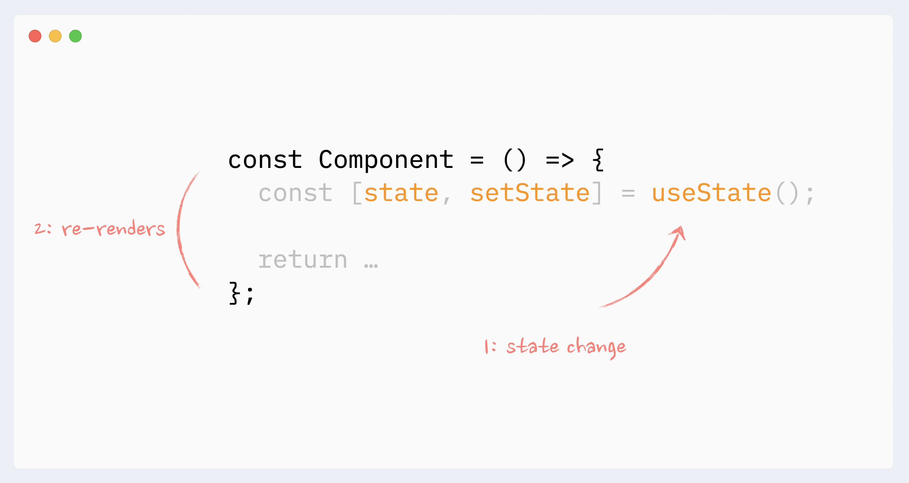

#### 🧐 리렌더링 이유: 부모 리렌더링

부모가 리렌더링되면 자식 컴포넌트도 리렌더링됩니다. 반대로 보면, 컴포넌트가 리렌더링될 때 그 컴포넌트의 모든 자식도 함께 리렌더링됩니다.

리렌더링은 항상 트리 "아래쪽"으로 진행됩니다. 자식의 리렌더링은 부모의 리렌더링을 트리거하지 않습니다. (여기에는 몇 가지 주의사항과 엣지 케이스가 있으니, 더 자세한 내용은 전체 가이드를 참조하세요: [리액트 엘리먼트, 자식, 부모 및 리렌더링의 미스터리](https://www.developerway.com/posts/react-elements-children-parents)).

- [See example in codesandbox](https://codesandbox.io/s/part-2-2-re-renders-because-of-parent-b0xvxt?file=/src/App.tsx)
- [Watch "Intro to re-renders" on YouTube](https://youtu.be/qTDnwmMF5q8)

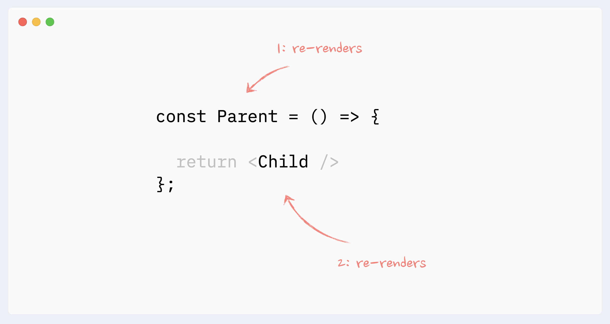

#### 🧐 리렌더링 이유: 컨텍스트 변화

컨텍스트 프로바이더의 값이 변경되면, 이 컨텍스트를 사용하는 모든 컴포넌트가 리렌더링됩니다. 변경된 데이터의 일부를 직접 사용하지 않더라도 마찬가지입니다. 이러한 리렌더링은 메모이제이션으로 직접 방지할 수는 없지만, 이를 시뮬레이션할 수 있는 몇 가지 우회 방법이 있습니다([파트 7: 컨텍스트로 인한 리렌더링 방지(원본링크)](https://www.developerway.com/posts/react-re-renders-guide#part7) 참조).

• [See example in codesandbox](https://codesandbox.io/s/part-2-3-re-render-because-of-context-i75lwh?file=/src/App.tsx)

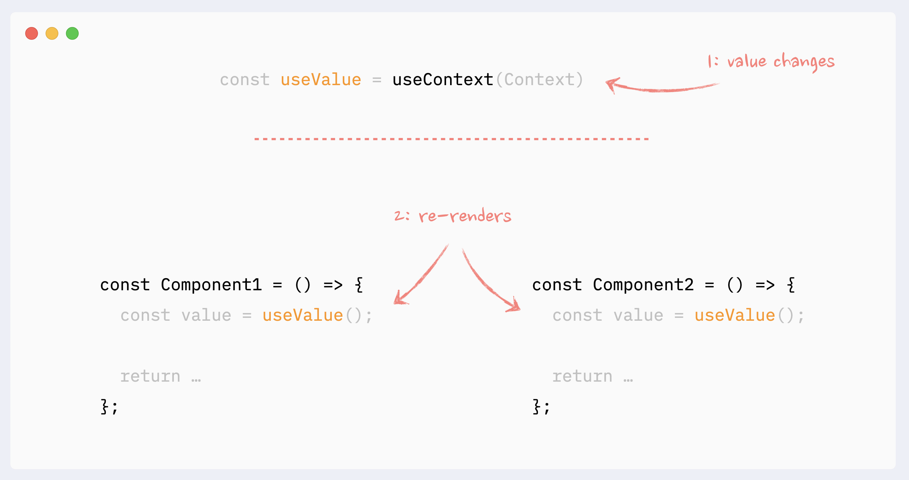

#### 🧐 리렌더링 이유: 훅 변화

훅 내에서 발생하는 모든 것은 이를 사용하는 컴포넌트에 "속"합니다. 여기서도 컨텍스트와 상태 변화에 대한 동일한 규칙이 적용됩니다:

- 훅 내에서 상태가 변경되면 "host" 컴포넌트의 리렌더링이 불가피하게 발생합니다.
- 훅이 컨텍스트를 사용하고 그 컨텍스트의 값이 변경되면, "host" 컴포넌트의 리렌더링이 불가피하게 발생합니다.

훅은 체인으로 연결될 수 있습니다. 체인 내의 각 훅은 여전히 "host" 컴포넌트에 속하며, 동일한 규칙이 모든 훅에 적용됩니다.

- [See example in codesandbox](https://codesandbox.io/s/part-2-4-re-render-because-of-hooks-5kpdrp?file=/src/App.tsx)
- [Watch "Intro to re-renders" on YouTube](https://youtu.be/qTDnwmMF5q8)

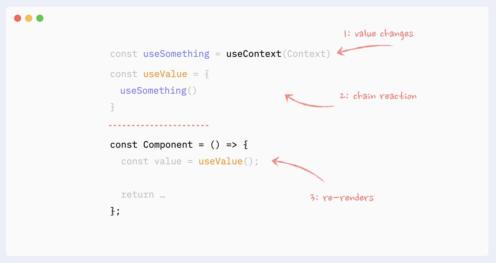

#### ⛔️ 리렌더링 이유: props 변화 (오해)

리렌더링되지 않은 컴포넌트의 리렌더링에 대해 이야기할 때, 컴포넌트의 props가 변경되었는지 여부는 중요하지 않습니다.

props가 변경되기 위해서는 부모 컴포넌트에서 업데이트되어야 합니다. 이는 부모가 리렌더링되어야 하며, 이로 인해 자식 컴포넌트도 props와 관계없이 리렌더링됩니다.

오직 메모이제이션 기법(예: `React.memo`, `useMemo`)을 사용할 때만 props 변화가 중요해집니다.

- [See example in codesandbox](https://codesandbox.io/s/part-2-5-re-render-props-not-relevant-2b8o0p?file=/src/App.tsx)
- [Watch "Intro to re-renders" on YouTube](https://youtu.be/qTDnwmMF5q8)

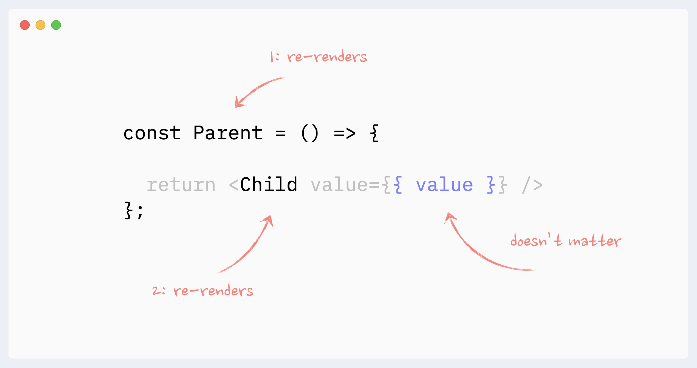

## 리렌더링 방지: 조합(이하 Composition)

#### ⛔️ 안티패턴: 렌더 함수 내에서 component 생성

다른 컴포넌트의 렌더 함수 내에서 컴포넌트를 생성하는 것은 성능 저하의 가장 큰 원인이 될 수 있는 안티패턴입니다. 매 리렌더링 시 React는 이 컴포넌트를 재마운트(즉, 파괴하고 처음부터 다시 생성)하게 되며, 이는 일반적인 리렌더링보다 훨씬 느립니다. 이로 인해 다음과 같은 버그가 발생할 수 있습니다:

- 리렌더링 중 내용의 "플래시" 현상
- 매 리렌더링 시 컴포넌트의 상태가 초기화됨
- 의존성이 없는 `useEffect`가 매 리렌더링마다 실행됨
- 포커스가 있었던 컴포넌트의 포커스가 사라짐

추가 자료:

- [See example in codesandbox](https://codesandbox.io/s/part-3-1-creating-components-inline-t2vmkj?file=/src/App.tsx)
- 왜 이런 일이 발생하는지 자세히 읽기: [React reconciliation: how it works and why should we care](https://www.developerway.com/posts/reconciliation-in-react)
- YouTube: [Mastering React Reconciliation](https://youtu.be/cyAbjx0mfKM)

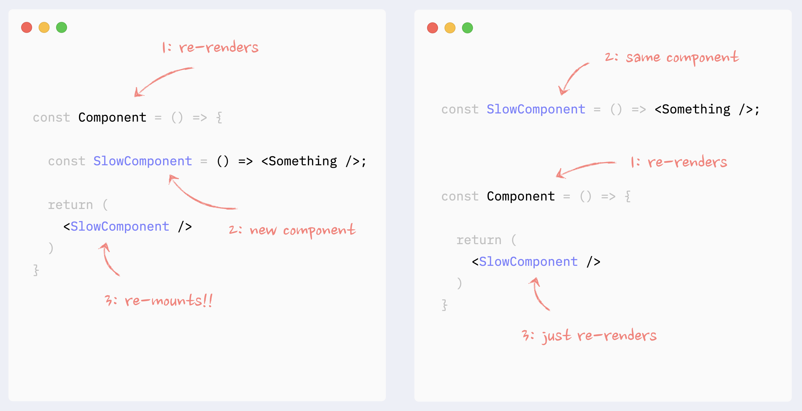

#### ✅ 리렌더링 방지를 위한 Composition : 상태 내려 보내기

이 패턴(moving state down)은 무거운 컴포넌트가 상태를 관리하며, 그 상태가 렌더 트리의 작은 고립된 부분에서만 사용될 때 유용합니다. 전형적인 예로는 복잡한 컴포넌트 내에서 버튼 클릭으로 대화 상자를 열거나 닫는 경우가 있습니다.

이 경우, 모달 대화 상자의 표시를 제어하는 상태, 대화 상자 자체, 그리고 업데이트를 트리거하는 버튼을 더 작은 컴포넌트에 캡슐화할 수 있습니다. 결과적으로 큰 컴포넌트는 이러한 상태 변화에 따라 리렌더링되지 않습니다.

- [See example in codesandbox](https://codesandbox.io/s/part-3-2-moving-state-down-vlh4gf?file=/src/App.tsx)
- 더 자세히 읽기: [The mystery of React Element, children, parents and re-renders](https://www.developerway.com/posts/react-elements-children-parents)
- Reconciliation에 대해: [React reconciliation: how it works and why should we care](https://www.developerway.com/posts/reconciliation-in-react)
- YouTube: [Intro to re-renders - Advanced React Course, Episode1](https://youtu.be/qTDnwmMF5q8)

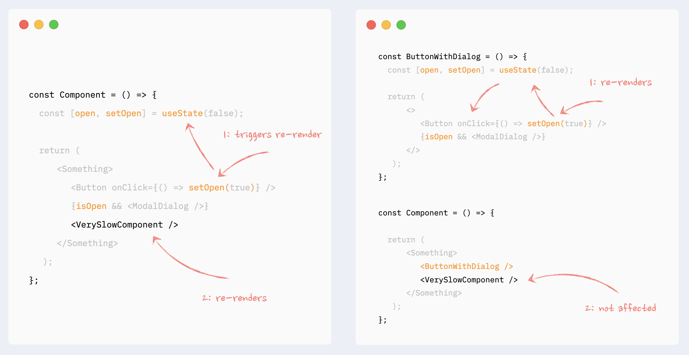

#### ✅ 리렌더링 방지를 위한 Composition : 자식으로서의 props

이 패턴은 "wrap state around children(자식을 state로 감싸기)”라고도 할 수 있습니다. 이 방식은 "상태 내려 보내기"와 비슷한 패턴으로, 상태 변경을 더 작은 컴포넌트로 캡슐화합니다. 여기서의 차이점은 상태가 렌더 트리의 느린 부분을 감싸는 요소에 사용되므로 쉽게 추출할 수 없다는 것입니다. 일반적인 예로는 컴포넌트의 루트 요소에 연결된 `onScroll` 또는 `onMouseMove` 콜백이 있습니다.

이러한 상황에서 상태 관리와 그 상태를 사용하는 컴포넌트를 더 작은 컴포넌트로 추출하고, 느린 컴포넌트를 `children`으로 전달할 수 있습니다. 더 작은 컴포넌트의 관점에서 `children`은 단순히 prop이므로 상태 변경의 영향을 받지 않아 리랜더링되지 않습니다.

- [See example in codesandbox](https://codesandbox.io/s/part-3-3-children-as-props-59icyq?file=/src/App.tsx)
- Composition에 대하여: [The mystery of React Element, children, parents and re-renders](https://www.developerway.com/posts/react-elements-children-parents)
- YouTube: [Elements, Children and Re-renders - Advanced React course, Episode 2](https://youtu.be/So6plt0QE_M)

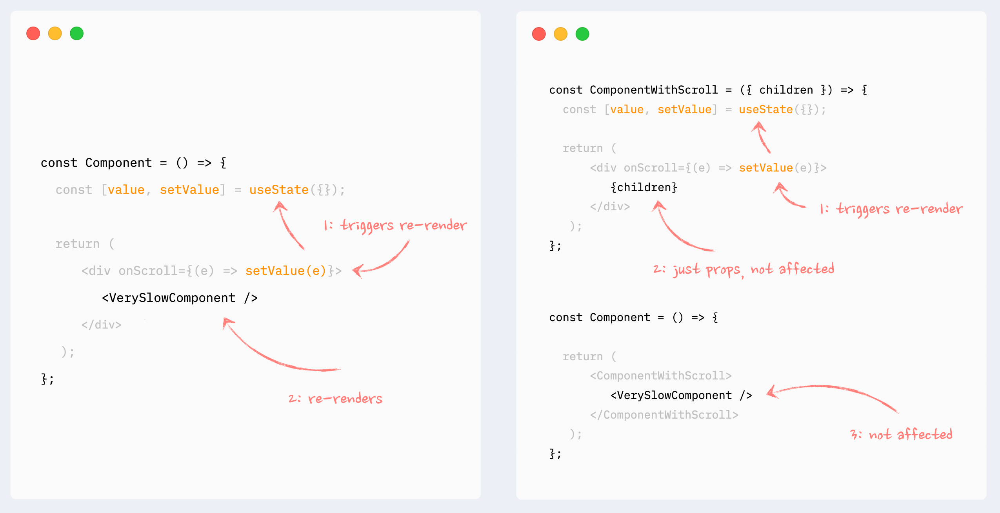

#### 리랜더링 방지를 위한 Composition : 컴포넌트를 prop으로 전달하기

이전 패턴과 매우 유사하며 동일한 동작을 합니다. 상태를 더 작은 컴포넌트 내부에 캡슐화하고, 무거운 컴포넌트를 prop으로 전달합니다. prop은 상태 변경의 영향을 받지 않으므로, 무거운 컴포넌트는 리랜더링되지 않습니다.

몇몇 무거운 컴포넌트가 상태와 독립적이지만, 그룹으로 자식 컴포넌트로 추출할 수 없는 경우에 유용합니다.

- [See example in codesandbox](https://codesandbox.io/s/part-3-4-passing-components-as-props-9h3o5u?file=/src/App.tsx)
- 컴포넌트와 prop: [React component as prop: the right way™️](https://www.developerway.com/posts/react-component-as-prop-the-right-way)
- YouTube: [Components as props - Advanced React course, Episode 3](https://youtu.be/gEW0Wv0DMso)

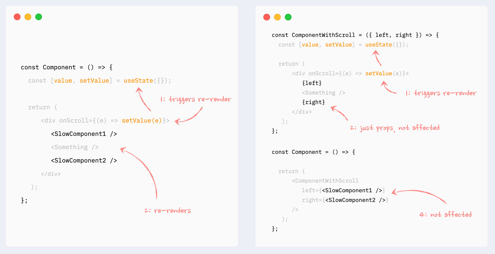

## React.memo를 이용한 리랜더링 방지

`React.memo`로 컴포넌트를 래핑하면 렌더 트리의 어딘가에서 트리거된 하위 리랜더링 연쇄가 중단됩니다. 단, 이 컴포넌트의 props가 변경되지 않은 경우에만 해당됩니다.

이것은 리랜더링의 원인(즉, 상태, 변경된 데이터)에 의존하지 않는 무거운 컴포넌트를 렌더링할 때 유용할 수 있습니다.

- [See example in codesandbox](https://codesandbox.io/s/part-4-simple-memo-fz4xhw?file=/src/App.tsx)
- Youtube: [Mastering memoization in React - Advanced React course, Episode 5](https://youtu.be/huBxeruVnAM)

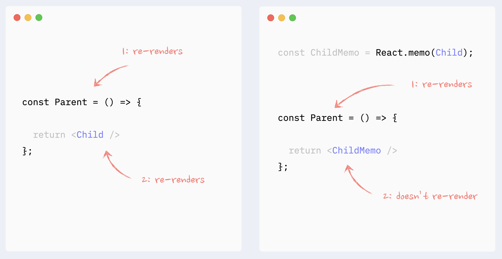

#### React.memo: props가 있는 컴포넌트

`React.memo`가 작동하려면 원시 값(primitive values)이 아닌 모든 props를 메모이제이션해야 합니다.

- [See example in codesandbox](https://codesandbox.io/s/part-4-1-memo-on-component-with-props-fq55hm?file=/src/App.tsx)
- Youtube: [Mastering memoization in React - Advanced React course, Episode 5](https://youtu.be/huBxeruVnAM)

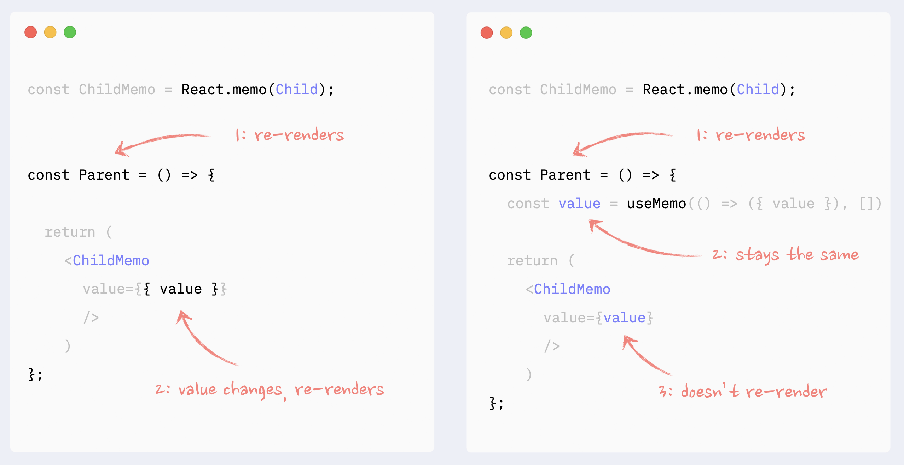

#### React.memo: props 또는 자식으로서의 컴포넌트

`React.memo`는 자식 컴포넌트 또는 props로 전달된 요소에 적용되어야 합니다. 부모 컴포넌트를 메모이제이션하는 것은 작동하지 않습니다. 자식 컴포넌트와 props는 객체이므로 매번 렌더링될 때 변경됩니다.

- [See example in codesandbox](https://codesandbox.io/s/part-4-2-memo-on-components-in-props-55tebl?file=/src/App.tsx)
- React의 부모와 자식 관계: [The mystery of React Element, children, parents and re-renders](https://www.developerway.com/posts/react-elements-children-parents)
- Youtube: [Mastering memoization in React - Advanced React course, Episode 5](https://youtu.be/huBxeruVnAM)

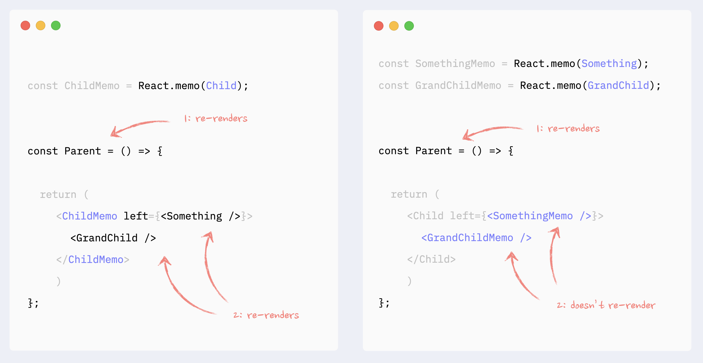

## useMemo/useCallback을 사용한 리랜더링 성능 개선

#### ⛔️ 안티패턴: 불필요한 props에 대한 useMemo/useCallback

props 자체를 메모리제이션 하는것은 자식 컴포넌트의 리랜더링을 방지하지 않습니다. 부모 컴포넌트가 리랜더링되면, props와 상관없이 자식 컴포넌트의 리랜더링이 발생됩니다.

- [See example in codesandbox](https://codesandbox.io/s/part-5-1-unnecessary-usememo-lmk8fq?file=/src/App.tsx)
- 더 알아보기: [How to useMemo and useCallback: you can remove most of them](https://www.developerway.com/posts/how-to-use-memo-use-callback)
- Youtube: [Mastering memoization in React - Advanced React course, Episode 5](https://youtu.be/huBxeruVnAM)

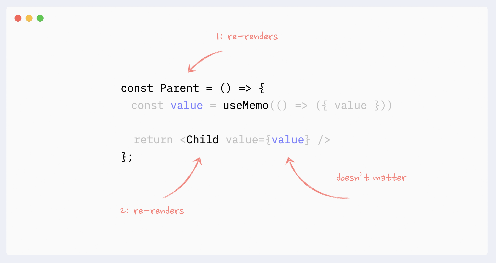

#### ✅ 필요한 useMemo/useCallback

자식 컴포넌트가 `React.memo`로 래핑되어 있다면, 원시 값(primitive values)이 아닌 모든 props를 메모리제이션 해야합니다.

- [See example in codesandbox](https://codesandbox.io/s/part-5-2-usememo-in-props-trx97x?file=/src/App.tsx)
- Youtube: [Mastering memoization in React - Advanced React course, Episode 5](https://youtu.be/huBxeruVnAM)

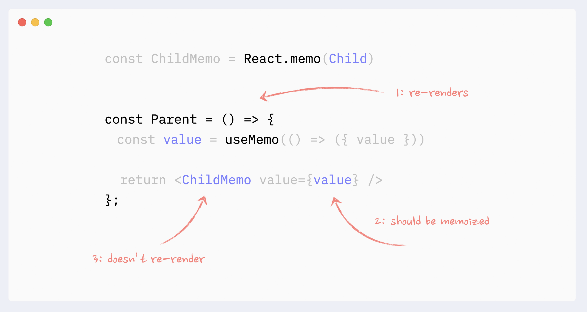

`useEffect`, `useMemo`, `useCallback`과 같은 Hook에서 의존성으로 사용하는 경우도 메모리제이션 되야 합니다.

- [See example in codesandbox](https://codesandbox.io/s/part-5-2-usememo-in-effect-88tbov)

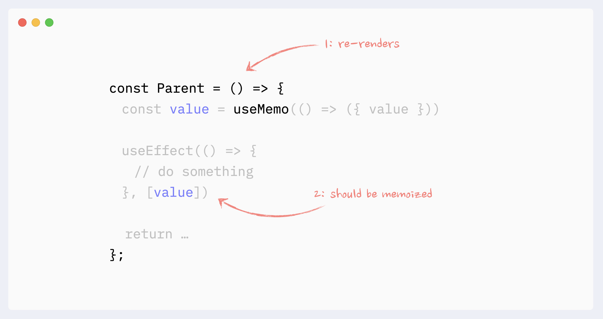

#### ✅ useMemo를 사용한 비용이 큰 계산의 최적화

`useMemo`의 사용 사례 중 하나는 매 리랜더링마다 비용이 큰 계산을 피하는 것입니다.

`useMemo`는 비용이 발생합니다(약간의 메모리를 소비하고 초기 렌더링을 느리게 만듭니다). 따라서 모든 계산에 사용해서는 안 됩니다. React에서 대부분의 경우 컴포넌트의 마운트와 업데이트가 가장 비용이 많이 드는 계산입니다(프론트엔드에서 해서는 안 되는 소수를 실제로 계산하는 경우가 아니라면).

결과적으로 `useMemo`의 일반적인 사용 사례는 React 요소를 메모리제이션하는 것입니다. 예를 들어 새로운 요소(일반적으로 기존 렌더 트리의 일부 또는 생성된 렌더 트리의 결과)를 반환하는 `map` 함수입니다.

배열을 정렬하거나 필터링하는 것과 같은 "순수한" JavaScript 연산의 비용은 일반적으로 컴포넌트 업데이트에 비해 무시할 수 있습니다.

- [See example in codesandbox](https://codesandbox.io/s/part-5-3-usememo-for-expensive-calculations-trx97x?file=/src/App.tsx)
- Youtube: [Mastering memoization in React - Advanced React course, Episode 5](https://youtu.be/huBxeruVnAM)

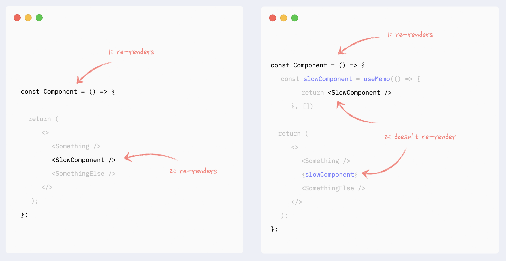

## 리스트의 리랜더링 성능 개선

일반적인 리랜더링 규칙과 패턴 외에도 `key` 속성은 React에서 리스트의 성능에 영향을 줄 수 있습니다.

**중요:** `key` 속성을 단순히 제공하는 것만으로는 리스트의 성능이 향상되지 않습니다. 리스트 요소의 리랜더링을 방지하려면 `React.memo`로 래핑하고 모든 모범 사례를 따라야 합니다.

`key`의 값은 문자열이어야 하며, 리스트의 모든 요소에 대해 리랜더링 간 일관성이 있어야 합니다. 일반적으로 항목의 `id` 또는 배열의 `index`가 사용됩니다.

리스트가 정적이고, 즉 요소가 추가/제거/삽입/재정렬되지 않는 경우 배열의 `index`를 `key`로 사용해도 됩니다.

동적 리스트에서 배열의 `index`를 사용하면 다음과 같은 문제가 발생할 수 있습니다.

- 항목에 상태나 제어되지 않는 요소(예: 양식 입력)가 있는 경우 버그가 발생할 수 있습니다.
- 항목이 `React.memo`로 래핑된 경우 성능이 저하될 수 있습니다.

추가 자료:

- key에 대하여: [React key attribute: best practices for performant lists](https://www.developerway.com/posts/react-key-attribute)
- 재조정에 대하여: [Mastering React Reconciliation - Advanced React course, Episode 6](https://youtu.be/cyAbjx0mfKM)
- [See example in codesandbox - static list](https://codesandbox.io/s/part-6-static-list-with-index-and-id-as-key-7i0ebi?file=/src/App.tsx)
- [See example in codesandbox - dynaminc list](https://codesandbox.io/s/part-6-dynamic-list-with-index-and-id-as-key-s50knr?file=/src/App.tsx)

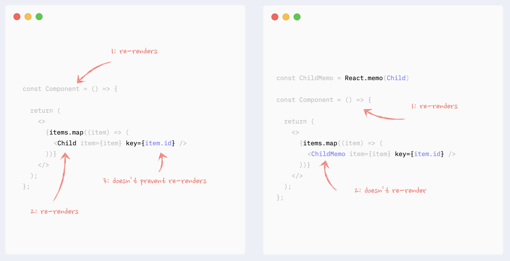

#### **⛔️ 안티패턴: 리스트에서 임의의 값을 key로 사용하기**

임의로 생성된 값은 리스트의 `key` 속성의 값으로 절대 사용해서는 안 됩니다. 이는 React가 모든 리렌더링 시 항목을 재마운트하게 하여 다음과 같은 문제를 야기합니다.

1. 리스트의 매우 낮은 성능
2. 항목에 상태나 제어되지 않는 요소(예: 양식 입력)가 있는 경우 버그 발생

- [See example in codesandbox](https://codesandbox.io/s/part-6-1-random-values-in-keys-z1zhy6?file=/src/App.tsx)

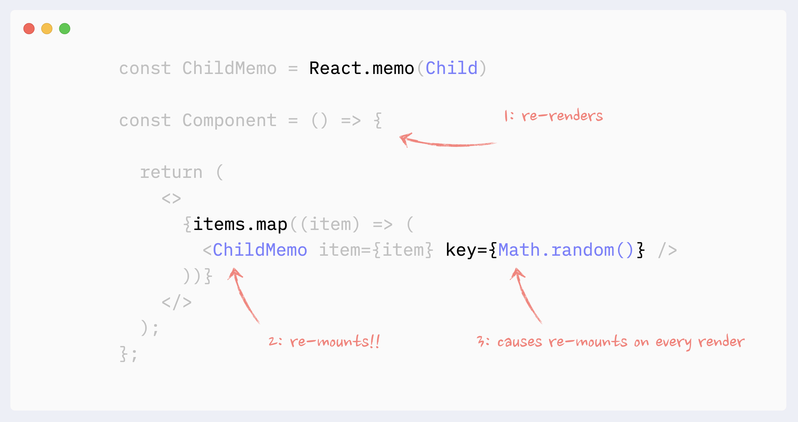

## 컨텍스트에 의한 리랜더링 방지

#### ✅ 컨텍스트 리랜더링 방지 : Provider 값 메모리제이션

Context Provider가 앱의 최상위에 배치되지 않고, 조상(부모 혹은 그 상위의 부모)의 변경으로 인해 자체적으로 리랜더링 가능성이 있는 경우, 해당 값을 메모이제이션해야 합니다.

- https://codesandbox.io/s/part-7-1-memoize-context-provider-value-qgn0me?file=/src/App.tsx

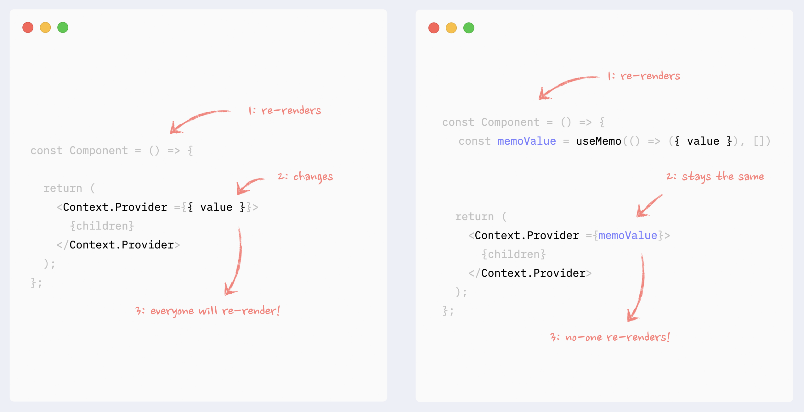

#### ✅ 컨텍스트 리랜더링 방지 : 데이터와 API의 분리

만약 Context에 데이터와 API(getter와 setter)가 결합되어 있다면, 같은 컴포넌트 아래에 다른 Provider로 분할할 수 있습니다. 이렇게 하면 API만 사용하는 컴포넌트는 데이터가 변경될 때 리랜더링되지 않습니다.

이 패턴에 대해 더 자세히 읽어보세요: [How to write performant React apps with Context](https://www.notion.so/React-12983788eeef800d87cbd18dc491e819?pvs=21)

- [See example in codesandbox](https://codesandbox.io/s/part-7-2-split-context-data-and-api-r8lsws?file=/src/App.tsx)

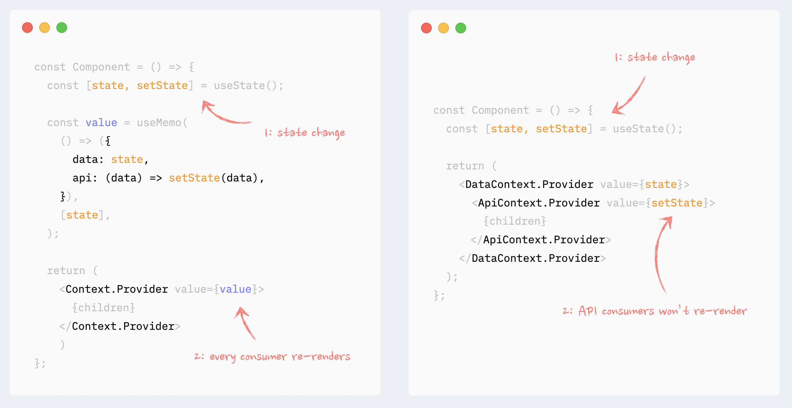

#### ✅ 컨텍스트 리랜더링 방지 : 청크로 데이터 분리

만약 Context가 몇 개의 독립적인 데이터 청크를 관리한다면, 같은 Provider 아래에서 더 작은 Provider로 분할할 수 있습니다. 이렇게 하면 변경된 청크의 소비자만 리랜더링됩니.

이 패턴에 대해 더 자세히 읽어보세요: [How to write performant React apps with Context](https://www.notion.so/React-12983788eeef800d87cbd18dc491e819?pvs=21)

- [See example in codesandbox](https://codesandbox.io/s/part-7-3-split-context-into-chunks-dbg20m?file=/src/App.tsx)

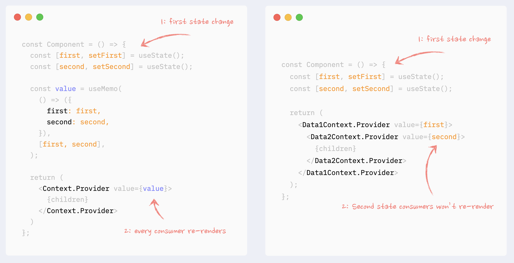

#### ✅ 컨텍스트 리랜더링 방지 : 컨텍스트 선택자

`useMemo` 에 의해 값이 변경되지 않았음에도 불구하고, 컨텍스트를 구독하는 일부 컴포넌트가 리랜더링되는 것을 방지할 수 없습니다. 그러나 고차 컴포넌트(HoC)와 `React.memo`를 사용하여 Context 선택자를 만들 수 있습니다.

이 패턴에 대해 더 자세히 읽어보세요: [Higher-Order Components in React Hooks era](https://www.developerway.com/posts/higher-order-components-in-react-hooks-era)

- [See example in codesandbox](https://codesandbox.io/s/part-7-4-context-selector-lc8n5g?file=/src/App.tsx)

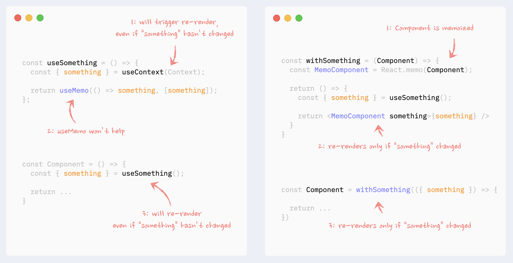
