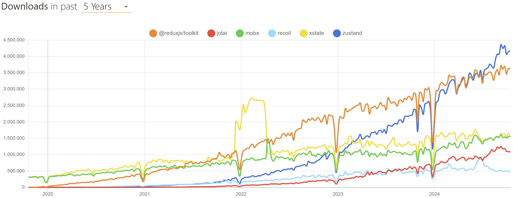
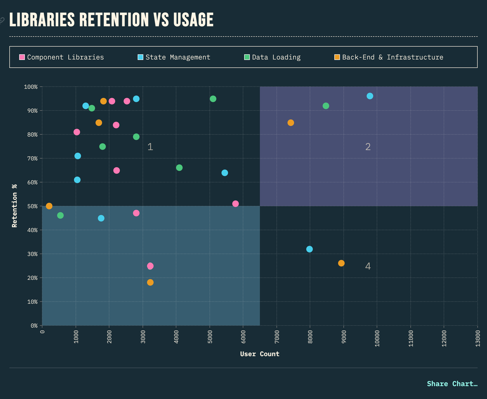

# React 생태계의 전역 상태: Flux 패턴과 최신 라이브러리

React에서 Global State, 전역 상태는 React 어플리케이션의 모든 요소가 공유하는 데이터 혹은 상태를 말한다. React로 App을 만들어 본 개발자라면 이 상태를 관리하는 것이 얼마나 중요한지 알 것이다. React에서 “상태(`state`)”는 UI를 동적으로 만들어 준다. 이를 통해 우리는 유저와 상호작용 가능한 어플리케이션을 만들 수 있다. 그 상태 중 모든 요소에서 접근 가능한 전역 상태는 흔히 Redux나 React의 컨텍스트 API와 같은 상태 관리자를 통해 글로벌 객체에 저장된다.

전역 상태를 더 알아보기 이전에 React에서 상태(`state`)의 특징을 잠깐 돌아보자면 React에서 상태는 불변성(**Immutability**)을 지니고 있다. 이는 리액트가 상태를 업데이트 하는 원리 때문인데, 리액트는 상태값을 업데이트 할 때 얕은 비교를 수행하기 때문이다. 만약 `state`에 Object가 저장되어 있다면 그 Object의 속성에 대한 값을 비교하는 것이 아니라, `state`의 메모리 참조값을 비교하여 상태를 갱신하게 된다. 즉 객체의 값을 변경해주는 것이 아니라 새로운 객체로 `state`를 재할당하는 것이다.

[!note] 배열을 `state`로 관리할 때 해당 배열에 새로운 배열을 저장하고자 할 때 Spread Operator를 쓰는 것 역시 이와 같은 이유 때문이다.

React는 Tree 구조로 어플리케이션을 구성하고 있다. 어플리케이션의 진입점인 `App` 에서 부터 Leaf-Node의 컴포넌트까지 그 구조가 이어져있으며 `prop` 을 통해 데이터를 내려줄 수 있다. 여기서 어플리케이션의 구조가 복잡해짐에 따라 하나의 needs가 발생하는데 만약 대부분의 컴포넌트에서 접근하고 싶은 데이터가 있다면 그 데이터는 `App` 에 선언되어 모든 컴포넌트에게 `prop` 으로 전달되어야 한다는 점이다. React의 컴포넌트가 언제 re-rendering 되는가를 고려해볼 때 이는 썩 좋은 방법이 아니라 생각된다.

이렇게 모든 컴포넌트가 필요한 데이터 혹은 tree구조에서 서로 멀리 떨어져 있는 Node 간 공유해야 하는 데이터, react-router가 도입되어 사로 다른 page route에 존재함에도 불구하고 공유해야 할 데이터가 있을 때에 우리는 전역 상태(Global State)의 도입을 선택하게 된다.

### Context API

우리가 흔히 `useState` 를 통해 생성하는 지역 상태의 `state`를 갱신할 때에는 이 API가 React의 불변성을 준수해주고 있기에 크게 고민해보지 않았지만, 전역 상태를 직접 개발하고자 할 때에는 이 문제가 대두된다. 상태가 변경됨에 따라 React Tree를 흔들어 변경된 상태가 즉각적으로 UI에 반영되기 위해서는 결국 React의 API를 사용하거나, 따로 저장되어 있는 값을 다시 `useState`로 복사하여 사용하여야 한다. 이러한 전역 상태를 핸들링하기 위해 React의 16.3버전에서 Context API가 등장하였다.

[!note] 엄밀히 표현하면 Context API의 등장은 `state`를 내려주기 위한 prop의 중첩 즉 드릴링(drilling)을 해결해주기 위함에 가깝다. 다만 본문에서는 전역 상태를 구현하기 위한 목적으로 Context API를 바라볼 것이기에 위와 같이 기재하였다. 전역 상태란 것이 결국 Tree 외부에 저장되어 있는 `state` 를 Leaf-Node에서도 직접 접근할 수 있도록 구조를 만드는 것이고 이를 Context-API가 충족시켜줄 수 있기 때문에 아주 틀린 설명은 아니다.

[Context API](https://react.dev/learn/passing-data-deeply-with-context)를 사용하면 일일이 `prop`으로 데이터를 넘겨주지 않고 값을 전파할 수 있다. Context는 `Context.Provider` 로 Context를 구독하는 모든 컴포넌트(`Context.Consumer`)에게 변화를 전파하고 `Context.Provider` 는 value로 `prop`을 받아서 이를 다시 구독하는 하위의 컴포넌트에게 값을 전달한다. `Context.Consumer`들은 [useContext Hook](https://react.dev/reference/react/useContext)을 통해 Provider의 value에 접근할 수 있다. 하지만 이런 Context API도 장점만을 지니고 있는 것은 아니다.

- Context API를 위한 디버깅 도구 부재
  전역으로 상태를 관리하다 보면 관리 할 데이터가 복잡해지고 그 데이터의 변경점을 쫓아가기 어렵도록 크게 확장될 가능성이 높다. 하지만 Context에서 이를 디버깅하려면 우리는 아주 원시적인 도구(`console.log`)를 사용해야 한다.
- 무분별한 리랜더링 발생
  Context API를 사용한다 해서 React Tree 구조를 벗어난 새로운 구조를 만든 것이 아니다. `Consumer`의 입장에서 `Provider`는 여전히 부모이고, 부모의 `state`가 변경되면 자식은 리랜더링이 발생한다. ~~이를 해결하기 위해 Provider에게 value를 전해줄 때 값을 useMemo로 매핑해서 전달하거나, 관리하고자 하는 전역 상태의 개수만큼 Provider를 늘리는 방식을 채택할 수 있다.~~
- Context Lost
  React Context API는 내부적으로 상태를 업데이트할 때에 그것을 검증하는 로직을 제공해주지 않는다. 우리는 `Provider`로 감싸진 `Consumer`만 Context의 `value`에 접근할 수 있음을 잊지 말아야 한다. 다른 라이브러리 혹은 LocalStorage와 같은 브라우저 저장소와 Context가 결합될 때에 그 연결점을 직접 구현하거나 이 모든 것을 감싸는 새로운 컨텍스트를 생성해야 한다.

### Redux, Flux Architecture

이제 전역 상태의 대명사가 되어 버린 Redux 이야기를 해보고자 한다. Redux가 React에서 사용하는 전역 상태를 일컫는 표현처럼 되어 버렸고 최신에 React 개발을 시작한 사람은 toolkit에 익숙해져 망각하기 쉽지만 [Redux](https://github.com/reduxjs/redux) 역시 라이브러리이다. 이 Redux에서 데이터의 불변성을 유지하고 저장소와 컴포넌트의 데이터 간 흐름을 구축할 때에 가장 많은 영향을 받은 것이 바로 [Flux](https://github.com/facebookarchive/flux)이다. 결국 Redux에서 데이터가 어떠한 방식으로 관리되고 처리되는지 이해하려면 이 Flux Architecture에 대한 이해가 필수적이다. 이제는 [Meta가 되어버린 구 Facebook에서 발표한 이 아키텍쳐](https://www.youtube.com/watch?v=nYkdrAPrdcw&list=PLb0IAmt7-GS188xDYE-u1ShQmFFGbrk0v&t=621s)는 단방향 데이터 흐름을 활용하여 React의 View 요소에 대한 저장소 기능을 제공한다.

위 이미지는 이 [문서](https://facebookarchive.github.io/flux/docs/in-depth-overview/)에 확인할 수 있다. 단방향 데이터 흐름은 Flux 패턴의 핵심이며 해당 패턴을 통해 스토어에서 데이터의 getter와 setter의 로직을 일관적으로 유지할 수 있다. 위 이미지에서 `Dispatcher`와 `Store` 그리고 `View`는 서로 다른 입력과 출력을 가진 독립적인 노드이고 액션은 데이터의 식별과 데이터의 유형 속성을 포함하는 객체이다. 조금 더 풀어서 설명을 보충하면 `Store`가 redux등으로 구현될 전역 객체 저장소를 의미하고 `View`는 사용자와 상호작용 하는 UI단의 컴포넌트 영역, 그리고 `Dispatch`는 유저의 클릭 등으로 발생하는 `Action`을 `Store`에게 전달하여 전역 상태가 갱신될 수 있는 역할을 담당한다.

사용자가 처음 화면을 보는 순간 즉 컴포넌트가 최초 랜더링되는 시점에서부터 상호작용하기 까지 모든 데이터는 `Dispatcher`를 통해 관리된다. `Dispatcher`는 스토어가 등록한 콜백을 호출하여 받은 `Action`으로 부터 변경 사항을 `Store`에게 알리고 `Store`는 변경 이벤트를 다시 `View`에게 전파해 데이터가 변경되었음을 알린다. `Store`로 관리되고 있는 전역 객체 중 어떠한 객체가 변경되었는지 그 객체가 어떠한 값으로 변경되었는지 등의 정보는 `Action`이 가지고 있다. 구성요소의 보다 자세한 설명은 ~~예전의 게시글이긴 하지만~~ [react의 legacy 문서](https://legacy.reactjs.org/blog/2014/07/30/flux-actions-and-the-dispatcher.html)에 잘 정리되어 있다.

Redux는 이러한 Flux 아키텍쳐 패턴의 단방향 흐름을 계승하여 `Store`의 구조를 설계하였다. 이후 Redux로 부터 탄생한 다른 라이브러리 역시 모태가 Flux에 있기 때문에 이 아키텍쳐에 대한 이해를 공고히 하면 어떠한 전역 상태 라이브러리를 선택하든, 동작을 이해하는 데에 큰 어려움은 없을 것이다. 마지막으로 Redux 이후의 주요 전역 상태 관리 라이브러리 알아보자.

### Library

2024년 9월 기준 주요 라이브러리의 다운로드 변동 지표를 위 사진과 같다. 위 정보는 연도별 node package download를 확인할 수 있는 [npmtrends](https://npmtrends.com/)에서 직접 확인할 수 있다. 2024년 6월 16일 redux를 그대로 계승하고 Meta가 관리하고 있는 `@reduxjs/toolkit` 을 다운로드를 횟수를 `zustand` 가 추월한 점이 인상적이다. 이것을 실제로 사용하고 있는 개발자의 입장은 어떨까.

[2023 State of React](https://2023.stateofreact.com/en-US)에서 전 세계 13,003명의 개발자로 대상으로 한 설문 결과 중 일부분이다. 이 중 우리가 관심있는 부분은 하늘색으로 표현되는 State Management 라이브러리인데 세부적인 결과는 아래와 같다.

- `useState` / 9,781 users / 96% retention
- `Redux` / 7,981 users / 32% retention
- `Redux toolkit` / 5,456 users / 64% retention
- `Zustand` / 2,811 users / 95% retention
- `Mobx` / 1,761 users / 45% retention
- `Jotai` / 1,303 users / 92% retention
- `Xstate` / 1,058 users / 71% retention
- `Recoil` / 1,052 users / 61% retention

다음은 각 라이브러리의 간단한 특징과 장점에 대해 살펴보자. 각자 구현하고자 하는 바에 따라 다른 요구사항과 환경에 처해있을테니 적절한 라이브러리를 선택하는 데에 도움이 되길 바란다.

[Redux Toolkit](https://redux-toolkit.js.org/)

- Redux의 복잡성을 줄이기 위해 만들어진 공식 패키지로, 상태 관리를 위한 도구와 유틸리티를 제공.
- 쉽게 설정할 수 있으며, 강력한 미들웨어와 개발자 도구를 통해 디버깅이 용이함.
- 불변성을 자동으로 처리하여 성능 최적화에 유리.

[Zustand](https://github.com/pmndrs/zustand)

- 간단하고 직관적인 API를 가진 경량 상태 관리 라이브러리로, React의 컨텍스트를 기반으로 함.
- 사용하기 쉽고, 복잡한 설정 없이 즉시 사용할 수 있어 빠른 개발에 적합.
- 선택적 구독을 통해 필요한 상태만 업데이트되어 성능이 우수함.

[MobX](https://mobx.js.org/README.html)

- 반응형 프로그래밍 모델을 기반으로 하여, 상태 변화가 UI에 자동으로 반영됨.
- 보일러플레이트 코드가 적고, 개발자가 간단하게 상태 관리를 할 수 있도록 지원.
- 필요한 부분만 리렌더링하여 효율적인 성능을 제공.

[Jotai](https://github.com/pmndrs/jotai)

- 원자 기반의 상태 관리를 제공하여, 상태를 작은 단위로 나누어 관리함.
- 간결하고 직관적인 API로, 상태를 쉽게 조작하고 공유할 수 있음.
- 각 원자 단위로 리렌더링이 발생해 성능이 뛰어남.

[XState](https://github.com/statelyai/xstate/tree/main/packages/core#readme)

- 유한 상태 기계와 상태 다이어그램을 기반으로 하여 복잡한 상태 관리를 지원.
- 상태 전이와 로직을 명확하게 표현할 수 있어, 복잡한 애플리케이션에 적합.
- 예측 가능한 상태 관리를 통해 디버깅이 쉬워짐.

[Recoil](https://github.com/facebookexperimental/Recoil#readme)

- React에 최적화된 상태 관리 라이브러리로, 원자와 셀렉터를 통해 상태를 관리함.
- 컴포넌트 간의 상태 공유가 용이하며, 상태의 의존성을 명확하게 관리할 수 있음.
- 선택적으로 리렌더링되는 특성 덕분에 성능이 개선됨.

### 결론

결론적으로 React에서 전역 상태 관리는 확장 가능하고 유지 관리가 용이한 애플리케이션을 구축하는 데 필수적이다. Flux, Redux 등 다양한 상태 관리 도구의 장단점을 이해함으로써 개발자들은 더 나은 선택을 할 수 있다. 2024년의 최신 트렌드를 반영하여 경량 라이브러리와 개선된 패턴을 활용하면 애플리케이션 성능과 개발자 경험을 크게 향상시킬 수 있다.

특히, 상태 관리의 복잡성이 증가함에 따라 개발자들은 프로젝트에 가장 적합한 도구를 선택하는 데 있어 더욱 세심한 접근이 필요한데 각 라이브러리의 생태계와 커뮤니티 지원, 학습 곡선 등을 고려해볼 수 있을 것이다. 결국 전역 상태 관리는 React 애플리케이션의 사용자 경험을 최적화하고 코드의 가독성과 유지 보수성을 높이는 데 중요한 역할을 하므로 상황에 맞는 선택을 할 수 있도록 하자.
