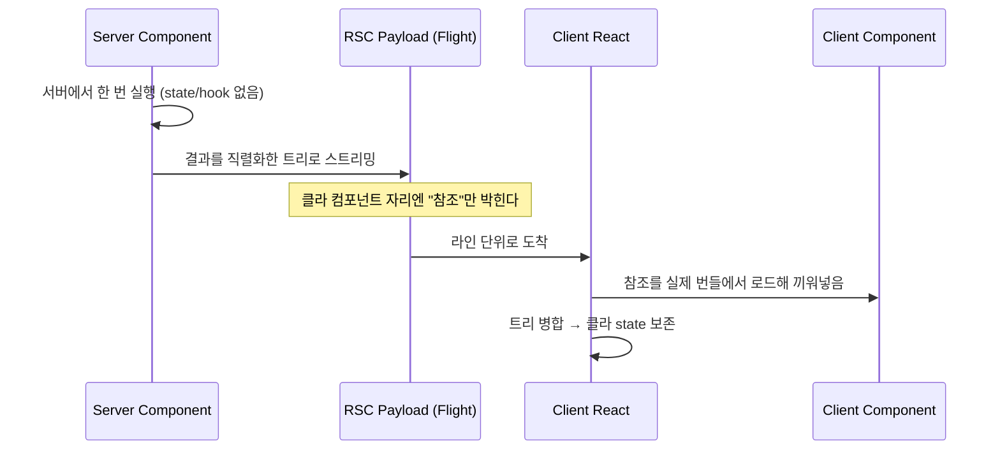

# React Server Component에 대한 고찰 : page router에서 app router로

[예전에 React의 리랜더링을 Render와 Commit으로 나눠 한참 파고든 적이 있다.](/article/react/reflections-on-react-re-rendering) 그때 내 머릿속 모델은 단순했다 — 컴포넌트는 브라우저에서 실행되고, 상태가 바뀌면 다시 실행되고(Render), 그 결과가 실제 DOM에 반영된다(Commit). 리랜더링 최적화라는 것도 결국 이 사이클을 얼마나 덜, 얼마나 싸게 돌리느냐의 문제였다.

그런데 요즘 나는 이 모델이 한쪽에서 흔들리는 걸 느낀다. 지금 우리 회사 서비스는 Next.js를 page router로 운영하고 있다. 큰 불만은 없다. `getServerSideProps`로 서버에서 데이터를 받아 내려주고, 나머지는 브라우저가 알아서 한다. ~~그리고 app router는 "언젠가 옮겨야지" 하며 미뤄둔 숙제였다.~~

미룬다고 사라지는 숙제는 아니라서, app router로의 전환을 슬슬 대비하며 React Server Component(이하 RSC)를 학습하기 시작했다. 그리고 얼마 안 가 깨달았다. 이건 폴더를 `pages/`에서 `app/`으로 옮기는 마이그레이션이 아니다. **렌더링이 "어디서" 일어나는가에 대한 사고를 통째로 바꾸는 일이다.** 이 글은 그 사고의 이동을 이론으로 먼저 그려보려는 시도다. 실제로 붙여보며 겪는 함정은 다음 글로 미룬다. 지금 이 글의 목적은 지형도를 그리는 것이지, 답사기를 쓰는 게 아니다.

#### page router의 세계관 (지금 내가 서 있는 곳)

전환을 얘기하려면 내가 지금 어디 서 있는지부터 분명히 해야 한다. page router에서 서버 사이드 데이터 페칭은 [`getServerSideProps`](https://nextjs.org/docs/pages/api-reference/functions/get-server-side-props) 같은 페이지 단위의 특별한 함수가 맡는다.

```tsx
// pages/dashboard.tsx — page router
// getServerSideProps는 "페이지 단위"로 서버에서 한 번 실행된다.
export const getServerSideProps: GetServerSideProps = async () => {
  const res = await fetch("https://api.example.com/projects");
  const projects = await res.json();
  // 데이터는 props로 직렬화되어 클라이언트로 내려간다.
  return { props: { projects } };
};

export default function Dashboard({ projects }: Props) {
  return (
    <ul>
      {projects.map((p) => (
        <li key={p.id}>{p.name}</li>
      ))}
    </ul>
  );
}
```

여기서 서버의 역할은 딱 두 가지다. 데이터를 미리 긁어서 props로 넘겨주는 것, 그리고 첫 HTML을 그려주는 것. 그 이후는 전부 클라이언트의 몫이다. `Dashboard` 컴포넌트 코드는 자바스크립트 번들에 담겨 브라우저로 내려가고, [hydration](https://react.dev/reference/react-dom/client/hydrateRoot)을 거쳐 브라우저에서 "다시" 살아난다. 서버가 그린 HTML은 어디까지나 첫 페인트를 빠르게 하기 위한 것이고, 렌더링의 주도권 자체는 처음부터 끝까지 클라이언트에 있다.

그러니까 page router의 세계관을 한 줄로 줄이면 이렇다 — **서버는 첫 HTML까지, 렌더는 전부 클라가.** 내가 리랜더링을 파고들 때 당연하게 깔고 있던 전제도 정확히 이거였다. 컴포넌트는 브라우저에서 돈다.

#### RSC란 무엇인가 — "서버에서 실행되는 컴포넌트"의 진짜 의미

"서버 컴포넌트"라는 이름은 오해를 부른다. SSR도 서버에서 도는데 뭐가 다르다는 건가. 나도 처음엔 그게 걸렸다.

[React 팀의 설명](https://react.dev/reference/rsc/server-components)은 이렇다. Server Components는 번들링 이전에, 클라이언트 애플리케이션과 분리된 환경에서 미리 실행되며, **자바스크립트 번들에서 제외된다.** 이 한 문장이 SSR과 RSC를 가른다. SSR은 클라이언트용 컴포넌트를 서버에서 "한 번 미리" 실행해 HTML을 뽑는 것이고(그 코드는 여전히 번들로 내려간다), 서버 컴포넌트는 애초에 **클라이언트 번들에 존재하지 않는** 컴포넌트다.

```tsx
// app/dashboard/page.tsx — app router (Server Component)
// async 함수 컴포넌트 자체가 서버에서 데이터를 가져온다.
// 이 코드와 여기 import된 것들은 클라이언트 번들에 포함되지 않는다.
export default async function Dashboard() {
  const res = await fetch("https://api.example.com/projects");
  const projects = await res.json();

  return (
    <ul>
      {projects.map((p) => (
        <li key={p.id}>{p.name}</li>
      ))}
    </ul>
  );
}
```

앞의 page router 코드와 나란히 두면 사고의 이동이 보인다. 페이지 바깥에 있던 `getServerSideProps`라는 특별한 함수가 사라지고, 데이터 페칭이 컴포넌트 **안으로** 들어왔다. 그리고 이 컴포넌트는 브라우저로 내려가지 않는다. 무거운 마크다운 파서든 DB 클라이언트든 여기서 import해 써도 [번들에 실리지 않는다](https://react.dev/reference/rsc/server-components).

대신 대가가 있다. 서버 컴포넌트에는 `useState`도 `useEffect`도 없다. 이벤트 핸들러도 못 붙인다. 애초에 브라우저에서 다시 실행될 일이 없으니 당연하다. 그러니 내가 그렇게 파고들었던 Render/Commit 사이클은 서버 컴포넌트에는 **적용되지 않는다.** 한 번 실행되고 끝이다. 리랜더링 멘탈모델의 절반이 갑자기 무효가 되는 영역이 생긴 것이다. ~~고찰까지 써가며 파둔 지식이 반쯤 통하지 않는 기분은 꽤 묘하다.~~

#### 직렬화된 결과, RSC payload

그럼 브라우저에서 실행되지도 않는 이 컴포넌트의 결과물은, 대체 무엇으로 클라이언트에 도착하는가.

HTML이라고 답하기 쉽지만 그게 핵심은 아니다. 서버 컴포넌트가 실행되면 그 결과는 [직렬화된 형태](https://github.com/reactwg/server-components/discussions/5)로 클라이언트에 전달된다 — 이걸 RSC payload, 혹은 내부 이름을 따 "Flight"라 부른다. 라인 기반의 스트리밍 포맷이고, 대략 이런 모양이다.

```text
1:"$Sreact.suspense"
2:I["./src/Counter.tsx",["chunk-abc.js"],"Counter"]
0:["$","ul",null,{"children":[["$","li",null,{"children":"project A"}]]}]
```

- 각 라인은 `id:payload` 꼴이고, 앞머리 문자가 payload의 종류를 가른다.
- `I` 같은 마커는 **클라이언트 컴포넌트 참조**다. "이 자리에는 클라에서 로드할 컴포넌트가 온다"는 포인터일 뿐, 코드 자체가 아니다.
- `$`로 시작하는 배열은 직렬화된 React 엘리먼트 트리다. `["$", 태그, key, props]` 구조를 눈으로 따라갈 수 있다.
- 아직 끝나지 않은 Promise나 스트리밍 청크를 나중에 채워 넣기 위한 마커도 있다.

핵심은 이거다. 서버 컴포넌트의 출력은 "완성된 HTML 문자열"이 아니라 **React가 이해하는 직렬화된 트리**라는 것. 클라이언트의 React는 이 payload를 받아 자기 트리를 재구성하고, 중간중간 박힌 클라이언트 컴포넌트 참조만 실제 번들에서 로드해 그 자리에 끼워 넣는다. 그래서 서버 컴포넌트를 다시 불러와도(가령 navigation) 이미 화면에 있던 클라이언트 컴포넌트의 state는 날아가지 않는다 — HTML을 통째로 갈아끼우는 게 아니라 트리를 병합하기 때문이다.

[!note] 여기서는 솔직히 짚고 넘어가야 한다. 이 Flight 포맷은 React가 **공식적으로 명세를 공개하고 안정성을 보장하는 API가 아니다.** 위 예시의 구체적인 마커 문자나 배치는 버전에 따라 바뀔 수 있는 내부 구현이고, 실제로 뜯어본 [커뮤니티의 리버스 엔지니어링 자료](https://www.smashingmagazine.com/2024/05/forensics-react-server-components/)에 기대어 그린 것이다.[break]그러니 "대략 이런 구조로 직렬화되어 흐른다" 정도로 받아들이는 게 맞다. 내가 이 절에서 하고 싶은 말은 포맷의 정확한 스펙이 아니라, 서버의 출력이 HTML이 아니라 "직렬화된 컴포넌트 트리"라는 사실 하나다. 이 결을 놓치면 그다음이 전부 어긋난다.



#### 'use client'는 스위치가 아니라 경계 선언

처음 app router를 보면 `'use client'`를 "이 컴포넌트는 클라에서 돌려라" 정도의 스위치로 이해하게 된다. 그런데 [공식 문서](https://react.dev/reference/rsc/use-client)의 표현은 다르다 — `'use client'` introduces a **server-client boundary** in the module dependency tree.

개별 컴포넌트에 붙이는 플래그가 아니라, 모듈 의존성 트리에 **경계선을 긋는 선언**이라는 얘기다. `'use client'`가 선언된 모듈부터 그 아래로 import되는 모든 것(transitive dependencies)이 클라이언트 코드가 된다. 자식마다 일일이 붙일 필요가 없다. 경계는 한 번 그어지고, 그 아래는 통째로 클라 영역이다.

이 "경계"라는 관점을 쥐고 나면 헷갈리던 규칙들이 자연스럽게 따라온다.

- 서버 컴포넌트가 클라이언트 컴포넌트에 넘기는 [props는 직렬화 가능해야 한다.](https://react.dev/reference/rsc/use-client) 함수나 클래스 인스턴스는 경계를 못 넘는다. 당연하다 — Flight로 직렬화할 수 없으니까. 경계를 넘는 순간 모든 건 payload에 실려야 하고, 실릴 수 없는 건 넘길 수 없다.
- 방향은 서버 → 클라 단방향이다. 클라이언트 컴포넌트가 서버 컴포넌트를 import해 자식으로 쓸 수는 없다. 대신 서버 컴포넌트를 `children`으로 **주입**받는 [composition 패턴](https://react.dev/reference/rsc/server-components)을 쓴다. 경계는 위에서 아래로만 그어진다.

결국 `'use client'`를 어디에 두느냐는 "이 컴포넌트를 클라에서 돌릴까 말까"의 문제가 아니라, **번들의 경계를 어디에 그을까**의 문제다. 잘못 그으면 클라 영역이 의도보다 넓게 번지고, 번들이 불어난다. 이건 최적화 스위치가 아니라 설계 결정이다.

#### 사고가 이동하는 지점들 (page router 습관이 깨지는 곳)

여기까지 오면 page router 습관이 어디서 깨지는지 정리된다.

가장 먼저 깨지는 건 데이터 페칭의 위치다. `getServerSideProps`처럼 페이지 최상단에서 한 번에 긁어오던 것을, 이제는 데이터가 필요한 컴포넌트가 직접 async로 가져온다. [Next 공식 문서](https://nextjs.org/docs/app/getting-started/fetching-data)도 데이터를 쓰는 컴포넌트로 페칭을 내리라고 안내한다. `getServerSideProps`는 app router에 아예 존재하지 않는다. 페이지 단위로 사고하던 습관이 컴포넌트 단위로 쪼개진다.

그리고 그 뒤로 따라오는 것들이 있다. 컴포넌트별 async는 [streaming과 Suspense](https://react.dev/reference/rsc/server-components)로 이어지고, 서버가 시작한 Promise를 클라이언트가 [`use` hook](https://react.dev/reference/react/use)으로 이어받는 그림이 나오고, 폼 제출은 `'use server'`를 단 server function으로 서버에 직접 꽂힌다. 하나하나가 그 자체로 큰 주제지만, 내 눈에는 전부 "렌더링이 어디서 일어나는가"라는 사고 전환의 **결과**로 보인다. 원인은 하나다. 그래서 이 글에서는 결과들을 나열하는 대신 원인 하나에 집중했다.

page router에서 우리는 "서버는 첫 페인트까지, 나머지는 클라"라는 경계를 당연하게 여겼다. app router는 그 경계를 컴포넌트 단위로, 그것도 개발자가 직접 긋게 만든다. 이게 자유일까, 부담일까? ~~지금 나로서는 둘 다인 것 같다.~~

#### 결론?

이론으로 지형은 그렸다. 전환은 구조가 아니라 사고의 이동이다 — page router의 "서버는 데이터, 렌더는 클라"에서, app router의 "경계를 어디에 그을지 내가 정한다"로. 폴더 이름이 `pages`에서 `app`으로 바뀌는 게 본질이 아니라, 컴포넌트가 어디서 실행되고 무엇이 번들에 실리는지를 매번 의식하게 되는 게 본질이다.

하지만 여기까지는 문서를 읽고 그린 지도일 뿐이다. 실제로 붙여보면 다를 거다. Next의 [공격적인 기본 캐싱](https://nextjs.org/docs/app/deep-dive/caching)이 어디서 나를 물지, `'use client'`가 예상보다 위로 전파되며 번들이 어떻게 불어날지, payload가 실제로 얼마나 크고 어디서 워터폴이 생기는지 — 이런 건 결국 몸으로 겪어야 안다. 리랜더링을 그렇게 파고도 처음의 의문을 끝내 다 못 풀었던 것처럼, 이번에도 지도와 지형은 분명 다를 것이다.

그래서 이 글은 여기서 멈춘다. 다음 글에서는 실제로 page router 프로젝트의 일부를 app router로 옮겨보고, 그 과정에서 이 지도가 어디서 틀렸는지를 들고 오려 한다. ~~아마 이 글의 절반쯤은 정정하게 되지 않을까 싶다.~~
