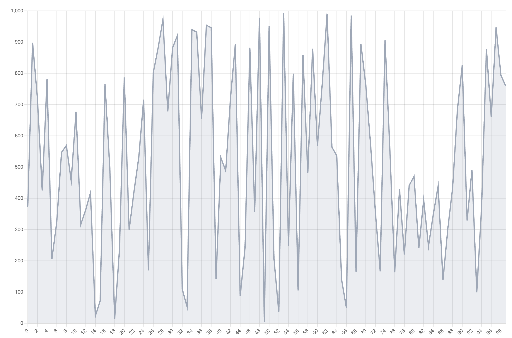
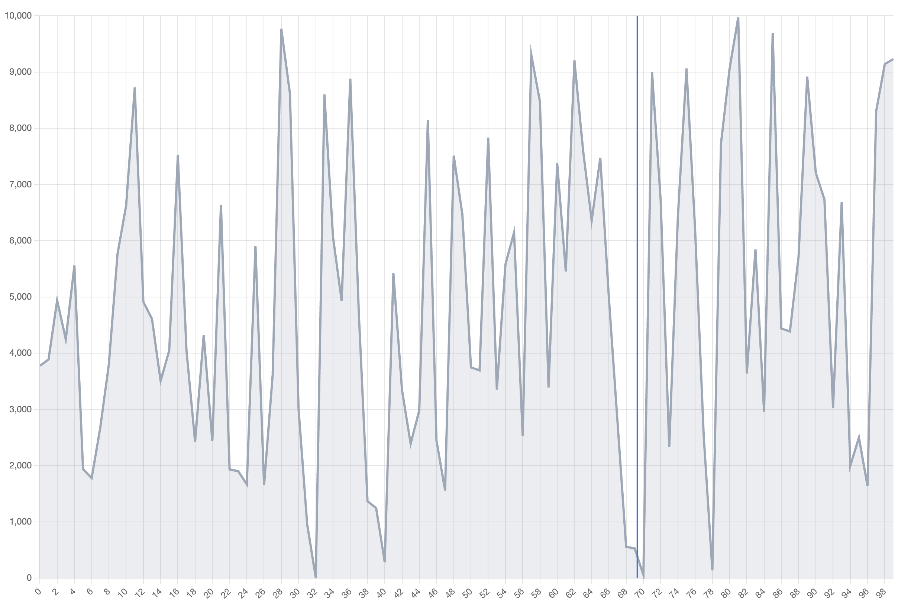
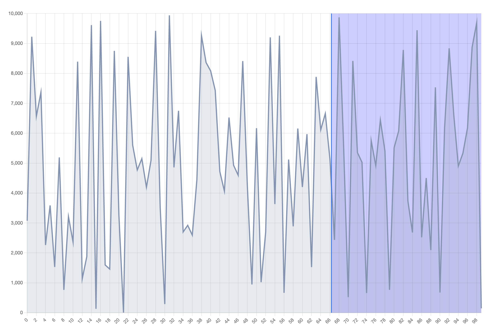
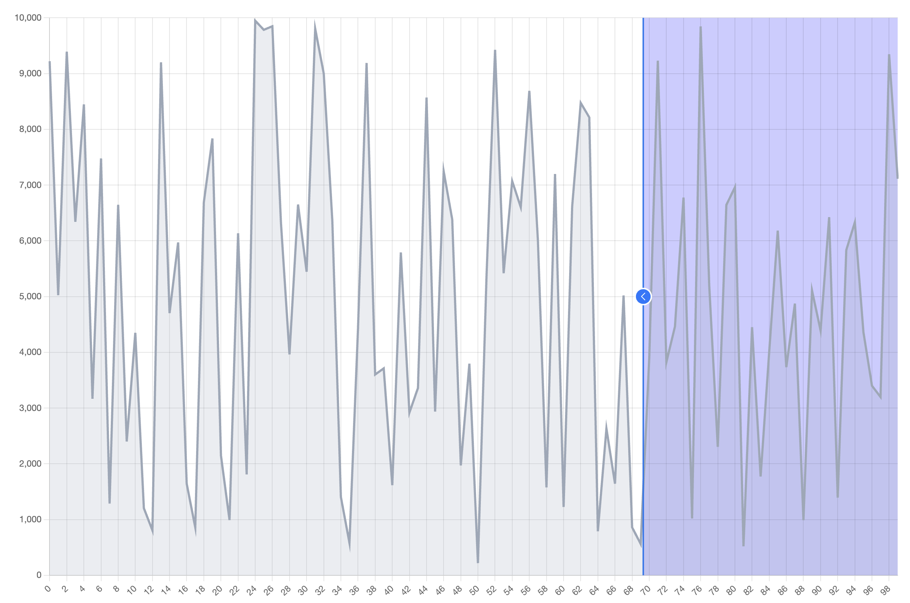

# Chart.js 커스텀 플러그인으로 구현하는 X-Axis Range Selector

[데모(DEMO)](#specific_content)

## Draw Line Chart

이번 게시글에선 React에서 ChartJS를 사용하여 X축의 Range Selector 기능을 가진 Line Chart를 만들어보고자 한다. Chart.js를 사용해보았다면 알겠지만 React의 LifeCycle과 독립적으로 Chart 내부 데이터가 관리되기에 고민해볼 거리가 많다. 일단 LineChart를 먼저 그려보자.

```tsx
npm install chart.js react-chartjs-2
yarn add chart.js react-chartjs-2
```

```tsx
import { Chart as ChartJS, LineElement } from "chart.js/auto";
import { Line } from "react-chartjs-2";

ChartJS.register(
  LineElement
  // (optional) Title,
  // (optional) Tooltip,
  // (optional) Legend,
  // (optional) Colors
);

const dummy = Array.from(new Array(100), (_, index) => [
  index,
  Math.round(Math.random() * 1000),
]);

function DragChart() {
  const chartRef = useRef<ChartJS<"line", number[], number>>(null);
  const data = {
    labels: dummyData.map((labelAndValue) => labelAndValue[0]),
    datasets: [
      {
        label: "data",
        borderColor: "rgb(156, 167, 184)",
        backgroundColor: "rgba(156, 167, 184, 0.2)",
        fill: "start",
        data: dummyData.map((labelAndValue) => labelAndValue[1]),
      },
    ],
  };

  return (
    <div style={{ width: "100%", height: "auto", minHeight: "320px" }}>
      <Line
        ref={chartRef}
        data={data}
        width={1200}
        height={800}
        options={{}}
        plugins={[]}
      />
    </div>
  );
}
```

`dummy` 는 랜덤한 숫자를 100개 생성한다. 해당 데이터를 바탕으로 가장 기본적인 Line Chart를 그렸다. `Title`과 `Tooltip` 등은 본인의 필요에 따라 추가하자. 이번 글에서 구현하고자 하는 차트는 마우스 드래그를 통해 X축을 선택가능한 라인 차트를 그리는 것이 목적이기에 다른 마우스 이벤트(`hoverRadius`, `tooltip` 등)들은 비활성화 할 필요가 있다. 이는 차트의 옵션을 제어함으로써 구현할 수 있다.

```tsx
const LineChartOptions = {
  responsive: true,
  maintainAspectRatio: false,
  plugins: {
    legend: {
      display: false,
    },
    tooltip: {
      enabled: false,
    },
  },
  hover: {
    mode: undefined,
  },
  elements: {
    point: {
      radius: 0,
      borderWidth: 0,
      hoverBorderWidth: 0,
      hoverRadius: 0,
    },
  },
  layout: {
    padding: 0,
  },
};

/* ... */

return (
  <div style={{ width: "100%", height: "auto", minHeight: "320px" }}>
    <Line
      ref={chartRef}
      data={data}
      width={1200}
      height={800}
      options={{ ...LineChartOptions }}
      plugins={[]}
    />
  </div>
);

/* ... */
```



## Draw Stroke

이제 차트 위에 Y축과 평행하는 세로선을 그려보자. ChartJS는 결국 데이터를 계산하며 `canvas` 로 화면을 그리기에 원하는 동작을 차트 밖에서 연산하기엔 껄끄롭다. 이를 해결하기 위해 커스텀 플러그인을 만들어 대응하자.

```tsx
const rangeSelectorPlugin = (initialVerticalLine: number) => ({
  id: "rangeSelectorPlugin",
  verticalLine: initialVerticalLine,
  calculateVerticalLinePosition(xAxis: Scale<CoreScaleOptions>) {
    return (this.verticalLine * xAxis.width) / 100 + xAxis.left;
  },

  afterDraw(chart: ChartJS<"line">) {
    const ctx = chart.ctx;
    const data = chart.data;
    if (!ctx || !data) return;

    const xAxis = chart?.scales["x"];
    const yAxis = chart?.scales["y"];
    if (!xAxis || !yAxis) return;

    const verticalLinePos = this.calculateVerticalLinePosition(xAxis);

    ctx.beginPath();
    ctx.lineWidth = 2;
    ctx.strokeStyle = "#1678EF";
    ctx.moveTo(verticalLinePos, yAxis.top);
    ctx.lineTo(verticalLinePos, yAxis.bottom);
    ctx.stroke();
  },
});

/* ... */

return (
  <div style={{ width: "100%", height: "auto", minHeight: "320px" }}>
    <Line
      ref={chartRef}
      data={data}
      width={1200}
      height={800}
      options={{ ...LineChartOptions }}
      plugins={[rangeSelectorPlugin(70)]}
    />
  </div>
);

/* ... */
```



위 코드에서 `rangeSelectorPlugin`는 라인을 최초에 그릴 포지션, %값을 받아 canvas의 [storke method](https://developer.mozilla.org/en-US/docs/Web/API/CanvasRenderingContext2D/stroke)로 라인을 그린다. 라인을 그릴 포지션은 `calculateVerticalLinePosition`에 의해 계산되는데 X축의 길이에 해당하는 위치를 구한 다음, left값을 더해 의도한 곳에 (예시에서는 70%) 위치하도록 한다. 해당 동작을 `afterDraw`에서 수행함을 확인하자. 차트는 마지막에 그린 요소를 가장 위에 그린다. 이를 통해 차트 데이터 위에 stroke를 그릴 수 있다. 이제 이 라인을 X축으로 드래그하여 0부터 라인포지션까지, 혹은 라인포지션부터 100까지의 range를 선택할 수 있도록 드래그 이벤트를 붙여야 한다. 이 게시글에서는 하나의 선만 그릴 예정이지만 혹시 두개의 선을 그리고 그 두 선 사이의 range를 선택하고 싶은 경우에도 코드를 응용할 수 있을 것이라 생각한다.

### Adding Mouse Event

이제 해당 라인을 움직일 수 있도록 mouseEvent를 정의해보자. 사용해야 할 이벤트는 `mousedown`, `mousemove`, `mouseup`, `mouseleave` 이다. 기본적으로 `mousemove` 에 따라 움직인 거리를 계산하여 stroke를 움직인다. 하지만 모든 이벤트에 대해 실행해주는 것이 아니라 마우스를 누르고 있을 때에만 실행해준다. 그것을 핸들링 하기 위해 `mousedown` 과 `mouseup` 을 이용할 예정이고 `mouseleave`는 차트를 벗어난 것이니 `mouseup` 과 동일하게 간주한다. `isDragging` 이란 변수를 만들어서 클릭이벤트가 발생했을 때 `true` 를 할당하고 해당 변수의 값이 참일 때에만 `mousemove` 가 동작되도록 설계했다.

```tsx
export const rangeSelectorPlugin = (initialVerticalLine: number) => ({
  id: 'rangeSelectorPlugin',
  isDragging: false,
  verticalLine: initialVerticalLine,
  offset: 0,
  eventHandlers: [] as {
    type: keyof HTMLElementEventMap;
    handler: EventListener;
  }[],
  calculateVerticalLinePosition(xAxis: Scale<CoreScaleOptions>) {
    return (this.verticalLine * xAxis.width) / 100 + xAxis.left;
  },
  /**
   * @see: https://github.com/chartjs/Chart.js/blob/47245a7/src/types/index.d.ts#L2234
   */
  afterRender(chart: ChartJS<'line'>) {
    const { ctx, canvas } = chart;
    if (!canvas || !ctx) return;

    const mouseDownHandler = (e: MouseEvent) => mouseClickEvent(e, chart, this);
    const mouseMoveHandler = (e: MouseEvent) => mouseMoveEvent(e, chart, this);
    const mouseUpHandler = () => mouseEndEvent(this);
    const mouseLeaveHandler = () => mouseEndEvent(this);

    // 이벤트 등록
    canvas.addEventListener('mousedown', mouseDownHandler);
    canvas.addEventListener('mousemove', mouseMoveHandler);
    canvas.addEventListener('mouseup', mouseUpHandler);
    canvas.addEventListener('mouseleave', mouseLeaveHandler);

    if (this.eventHandlers.length > 0) {
      this.eventHandlers.forEach(({ type, handler }) => {
        canvas.removeEventListener(type, handler);
      });
    }

    this.eventHandlers = [
      { type: 'mousedown', handler: mouseDownHandler as EventListener },
      { type: 'mousemove', handler: mouseMoveHandler as EventListener },
      { type: 'mouseup', handler: mouseUpHandler },
      { type: 'mouseleave', handler: mouseLeaveHandler },
    ];
  },

  /* ... */
}
```

`afterRender` 는 차트를 랜더링 하기 이전에 동작한다. stroke를 새로 그려주기 위하여 chart를 update할 예정이기에 많은 이벤트가 할당 될 여지가 있다. 이에 등록한 이벤트들을 배열로 관리하여 이벤트가 중복으로 등록되지 않도록 정의한다. 이제 각 이벤트를 살펴보자.

```tsx
const mouseClickEvent = (
  event: MouseEvent,
  chart: ChartJS<"line">,
  context: RangeSelectorPlugin
) => {
  const { scales, canvas } = chart;
  if (!canvas || !scales) return;

  const xAxis = scales["x"];
  const yAxis = scales["y"];
  if (!xAxis || !yAxis) return;

  const rect = chart.canvas.getBoundingClientRect();
  const x = event.clientX - rect.left;
  context.offset = x - (rect.width * context.verticalLine) / 100;
  context.isDragging = true;
};
```

첫번째는 mousedown 이벤트이다. 사용자가 좌클릭을 했을 때 발생하는 이벤트로, `isDragging` 을 관리하여 이후 발생 할 mousemove 이벤트에서 차트가 업데이트 될 수 있도록 한다. 여기서 등록해주는 `offset` 은 이후 stroke의 포지션을 계산하는 데에 사용된다.

```tsx
const mouseMoveEvent = (
  event: MouseEvent,
  chart: ChartJS<"line">,
  context: RangeSelectorPlugin
) => {
  const { scales, canvas } = chart;
  if (!canvas || !scales) return;

  const xAxis = scales["x"];
  const yAxis = scales["y"];
  if (!xAxis || !yAxis) return;

  const { verticalLine } = context;

  if (!context.isDragging) {
    return;
  }

  const rect = chart.canvas.getBoundingClientRect();
  const x = event.clientX - rect.left;
  const newPosition = Math.round(((x - context.offset) / rect.width) * 100);

  if (newPosition < 0 || newPosition > 99) {
    return;
  }

  if (chart) {
    context.verticalLine = newPosition;
    chart.update("active");
  }
};
```

두번째는 mousemove 이벤트이다. `isDragging` 이 `false` 라면 early return하는 것을 확인할 수 있다. 이후 움직인 거리를 바탕으로 `newPosition` 을 계산하고 그 값이 유효한 범위라면 `verticalLine`에 할당하고 차트를 update한다. 차트는 update 이벤트가 발생하면 다시 데이터를 그리고, `afterDraw` 에 의해 새로운 포지션으로 stroke가 그려지는 원리이다.

```tsx
const mouseEndEvent = (context: RangeSelectorPlugin) => {
  context.isDragging = false;
};
```

마지막으로 mouseup과 mouseleave에 동작하는 이벤트다. 클릭이 종료되거나 차트를 벗어난 다면 추가적인 `verticalLine` 의 갱신을 방지하기 위해 `isDragging` 의 값을 `false` 로 변경한다. 이제 마우스를 드래그하면 stroke를 우리가 원하는 대로 움직일 수 있다.

### Fill Rect

지금까지의 동작은 단순하게 stroke를 움직일 뿐이니 사용자에게 어떠한 영역을 선택했는지 시각적으로 보여줄 필요가 있다. 지금의 글에선 stroke부터 100%가 되는 지점까지 Rect를 그려 유저에게 알려주고자 한다. 그려진 Rect가 차트의 데이터를 가리면 안되니 호출해야 할 순간은 `beforeDraw` 이다. [canvas context의 clearRect Method](https://developer.mozilla.org/en-US/docs/Web/API/CanvasRenderingContext2D/clearRect)를 통해 이미 그려진 Rect를 제거하고, [fillRect](https://developer.mozilla.org/en-US/docs/Web/API/CanvasRenderingContext2D/fillRect)를 통해 새로운 Rect를 그린다.

```tsx
const drawRange = (
  ctx: CanvasRenderingContext2D,
  xAxis: Scale<CoreScaleOptions>,
  yAxis: Scale<CoreScaleOptions>,
  linePosition: number
) => {
  const { right } = xAxis;
  const { top, bottom } = yAxis;

  if (linePosition > right) {
    return;
  }

  ctx.clearRect(linePosition, top, right - linePosition, bottom - top);
  ctx.fillStyle = 'rgba(0, 0, 255, 0.2)';
  ctx.fillRect(linePosition, top, right - linePosition, bottom - top);
};

/* ... */
  beforeDraw(chart: ChartJS<'line'>) {
    const { ctx, data, scales } = chart;
    if (!ctx || !data || !scales) return;

    const xAxis = scales['x'];
    const yAxis = scales['y'];
    if (!xAxis || !yAxis) return;

    const verticalLinePos = this.calculateVerticalLinePosition(xAxis);
    drawRange(ctx, xAxis, yAxis, verticalLinePos);
  },
/* ... */
```



### Join React State

앞에서 이야기했듯 ChartJS의 라이프사이클과 React의 라이프사이클은 별개이다. 유저가 선택한 X축 범위를 React의 state로 추적하기 위해서는 추가적인 조취가 필요하다. `rangeSelectorPlugin` 에게 초기값으로 state의 값을 전달하고, `rangeSelectorPlugin`에서는 커스텀 이벤트를 발송하여 state의 값을 업데이트한다.

```tsx
/* ... */
function DragChart() {
  /* ... */
  const [state, setState] = useState(70);

  useEffect(() => {
    const verticalLineChangeEvent = (e: Event) => {
      if (!("detail" in e)) {
        return;
      }
      setState((prev) => {
        if (prev !== Number(e.detail)) {
          return Number(e.detail);
        }
        return prev;
      });
    };
    window.addEventListener("verticalLineChange", verticalLineChangeEvent);
  }, []);

  return (
    <div style={{ width: "100%", height: "auto", minHeight: "320px" }}>
      <Line
        ref={chartRef}
        data={data}
        width={1200}
        height={800}
        options={{ ...LineChartOptions }}
        plugins={[rangeSelectorPlugin(state)]}
      />
    </div>
  );
}
```

```tsx
const mouseMoveEvent = (
  event: MouseEvent,
  chart: ChartJS<"line">,
  context: RangeSelectorPlugin
) => {
  /* ... */

  if (chart) {
    context.verticalLine = newPosition;
    window.dispatchEvent(
      new CustomEvent("verticalLineChange", {
        detail: Math.round(context.verticalLine),
      })
    );
    chart.update("active");
  }
};
```

이제 `state` 의 초기값 위치로 stroke를 그리고, stroke가 마우스 움직임에 따라 포지션이 변경된다면 그 값을 `setState` 로 저장하여 추적할 수 있다.

### Advance : **Optimizing Chart Update**

위 과정만으로 요구사항은 모두 충족할 수 있지만 최적화에 따른 고민이 있을 수 있다. 현재 100개의 더미데이터로는 훌룡한 사용성을 보여주고 있지만 데이터가 더 복잡해질 수 있고, 사용하는 차트에 다른 플러그인들이 붙게 된다면 모를 일이다. 지금 우리의 코드에서는 사용자가 마우스를 움직일 때마다 차트를 업데이트 하고 있는데 이 과정에서 [animationFrame](https://developer.mozilla.org/ko/docs/Web/API/Window/requestAnimationFrame)을 적용해볼 수 있다. 이미 그리고 있는 와중에 새로운 mousemove 이벤트가 발생하여 새롭게 다시 그려야 한다면 이전에 그려지는 이벤트는 [cancelAnimationFrame](https://developer.mozilla.org/ko/docs/Web/API/Window/cancelAnimationFrame)으로 스케줄된 애니메이션 프레임을 취소하는 방식이다.

```tsx
const mouseMoveEvent = (
  event: MouseEvent,
  chart: ChartJS<"line">,
  context: RangeSelectorPlugin
) => {
  /* ... */
  if (chart) {
    context.verticalLine = newPosition;

    if (context.animationFrame) {
      cancelAnimationFrame(context.animationFrame);
    }

    context.animationFrame = requestAnimationFrame(() => {
      window.dispatchEvent(
        new CustomEvent("verticalLineChange", {
          detail: Math.round(context.verticalLine),
        })
      );
      chart.update("active");
    });
  }
};
```

`animationFrame` 은 `isDragging` , `verticalLine` 등과 마찬가지로 플러그인에 등록해주면 되고, 타입은 null 혹은 number, 초기값은 null이다.

### Advance : **Select Image at center of Stroke**

지금 차트를 살펴보면 차트의 어느 부분이든 클릭하면 stroke를 움직일 수 있다. 하지만 보통 그려진 라인을 클릭하여 움직하는 것이 일반적인 UI로 인식될 수 있는데, 이를 위해 stroke 위에 화살표 모양의 이미지를 그리고 그 이미지를 클릭하여 움직이는 것으로 차트를 발전해볼 수 있을 것 같다. 차트 위에 stroke를 그리든, Image를 그리든 결국 차트는 canvas로 화면에 랜더링된다. 이는 Image를 그리고 그 Image의 위치를 추적하여 사용자가 마치 이미지를 클릭한 듯한 착각을 만들어줘야 함을 의미한다. 이를 위한 첫번째 단계로 먼저 이미지를 그려보자. `afterDraw` 에서는 이미지와 stroke, 총 2개의 인스턴스를 관리해야 함으로 함수를 분리했다.

```tsx
const getImagePosition = (
  image: HTMLImageElement,
  verticalLine: number,
  yAxis: Scale<CoreScaleOptions>
) => {
  return {
    imageX: verticalLine - image.width / 2,
    imageY: (yAxis.top + yAxis.bottom) / 2 - image.height / 2,
  };
};

const drawVerticalLine = (
  ctx: CanvasRenderingContext2D,
  verticalLine: number,
  yAxis: Scale<CoreScaleOptions>,
  verticalImage: HTMLImageElement
) => {
  ctx.beginPath();
  ctx.lineWidth = 2;
  ctx.strokeStyle = "#1678EF";
  ctx.moveTo(verticalLine, yAxis.top);
  ctx.lineTo(verticalLine, yAxis.bottom);
  ctx.stroke();

  if (verticalImage.src) {
    const { imageX, imageY } = getImagePosition(
      verticalImage,
      verticalLine,
      yAxis
    );
    ctx.drawImage(verticalImage, imageX, imageY);
  } else {
    verticalImage.src = "/arrow-left.svg";
    verticalImage.onload = () => {
      const { imageX, imageY } = getImagePosition(
        verticalImage,
        verticalLine,
        yAxis
      );
      ctx.drawImage(verticalImage, imageX, imageY);
    };
  }
};

export const rangeSelectorPlugin = (initialVerticalLine: number) => ({
  id: "rangeSelectorPlugin",
  isDragging: false,
  verticalLine: initialVerticalLine,
  offset: 0,
  animationFrame: null as null | number,
  eventHandlers: [] as {
    type: keyof HTMLElementEventMap;
    handler: EventListener;
  }[],
  calculateVerticalLinePosition(xAxis: Scale<CoreScaleOptions>) {
    return (this.verticalLine * xAxis.width) / 100 + xAxis.left;
  },
  verticalImage: new Image(),

  /* ... */

  afterDraw(chart: ChartJS<"line">) {
    const { ctx, data, scales } = chart;
    if (!ctx || !data || !scales) return;

    const xAxis = chart.scales["x"];
    const yAxis = chart.scales["y"];
    if (!xAxis || !yAxis) return;

    const verticalLinePos = this.calculateVerticalLinePosition(xAxis);
    drawVerticalLine(ctx, verticalLinePos, yAxis, this.verticalImage);
  },
});
```

`getImagePosition` 은 이미지가 그려질 위치를 계산하는 함수이다. 어떤 크기의 이미지가 사용되든 동적으로 계산되도록 image의 width와 height가 계산 식에 반영된다. 계산되는 포지션은 차트의 y축 중간과 stroke가 만나는 지점이 이미지의 정중앙이 될 수 있도록 한다. 이렇게 그려진 이미지는 canvas의 [drawImage](https://developer.mozilla.org/en-US/docs/Web/API/CanvasRenderingContext2D/drawImage) 메서드를 호출하여 화면에 반영되도록 한다.



이제 이미지의 위치를 계산하여 그 이미지 위치에서 mousedown 이벤트가 발생했을 때에만 `isDragging` 의 값을 true로 변경하자. 이는 곧 stroke를 통해 x좌표를 계산하고, chart의 높이 절반을 통해 y좌표를 계산해야 함을 의미한다.

```tsx
const isMouseOverAtVerticalImage = ({
  rect,
  event,
  axisLeft,
  axisWidth,
  axisHeight,
  verticalLine,
}: {
  rect: DOMRect;
  event: MouseEvent;
  axisLeft: number;
  axisWidth: number;
  axisHeight: number;
  verticalLine: number;
}) => {
  const x = event.clientX - rect.left - axisLeft;
  const xPosition = (x / axisWidth) * 100;

  const y = event.clientY - rect.top;
  const yPosition = (y / axisHeight) * 100;

  return (
    (yPosition >= 45 || yPosition <= 55) &&
    Math.abs(xPosition - verticalLine) < 5
  );
};

const mouseClickEvent = (
  event: MouseEvent,
  chart: ChartJS<"line">,
  context: RangeSelectorPlugin
) => {
  const { scales, canvas } = chart;
  if (!canvas || !scales) return;

  const xAxis = scales["x"];
  const yAxis = scales["y"];
  if (!xAxis || !yAxis) return;

  const rect = chart.canvas.getBoundingClientRect();
  const x = event.clientX - rect.left;

  if (
    isMouseOverAtVerticalImage({
      rect: rect,
      event: event,
      axisLeft: xAxis.left,
      axisWidth: xAxis.width,
      axisHeight: yAxis.height,
      verticalLine: context.verticalLine,
    })
  ) {
    context.offset = x - (rect.width * context.verticalLine) / 100;
    context.isDragging = true;
  }
};
```

정확한 한 좌표만을 클릭하기엔 사용성이 떨어질 수 있기에 x축과 y축별로 5px 정도 ± 여유를 두었다. 이제 사용자에게 해당 좌표에 마우스가 진입하면 클릭하여 드래그할 수 있음을 알려주기 위해 cursor의 스타일을 변경해주는 코드를 mousemove 이벤트에 추가해주면 끝이다.

```tsx
const mouseMoveEvent = (
  event: MouseEvent,
  chart: ChartJS<"line">,
  context: RangeSelectorPlugin
) => {
  /* ... */

  if (
    isMouseOverAtVerticalImage({
      rect: chart.canvas.getBoundingClientRect(),
      event,
      axisLeft: xAxis.left,
      axisWidth: xAxis.width,
      axisHeight: yAxis.height,
      verticalLine,
    })
  ) {
    chart.canvas.style.cursor = "pointer";
  } else {
    chart.canvas.style.cursor = "default";
  }

  /* ... */
};
```

이렇게 이번에 ChartJS에서 커스텀 플러그인을 개발하여 X축 Range Selector를 직접 구현해보았다. 해당 기능들은 응용하여 두 라인 사이의 값을 선택하도록 만들거나, Y축 Selector로도 활용할 수 있을 것이다. 이때까지ChartJS를 단순히 사용하고 필요에 따라 option 정도만 조절해왔기에 나에게도 첫번째 작업이었다. 해당 기능을 개발하기 위해 많은 시행착오를 겪었는데, 특히나 어떤 기능을 ChartJS의 어떤 사이클에 호출해야 할지 판단하는 데에 큰 어려움이 있었다. 비슷한 기능개발을 목적으로 이 글을 읽는이에게 좋은 지침이 되었으면 한다.
