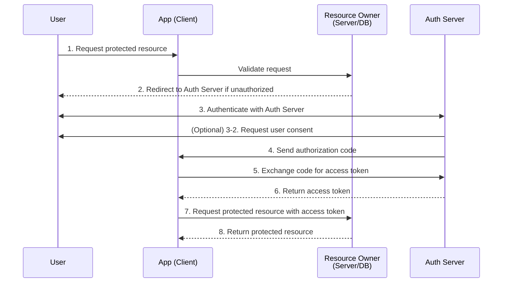
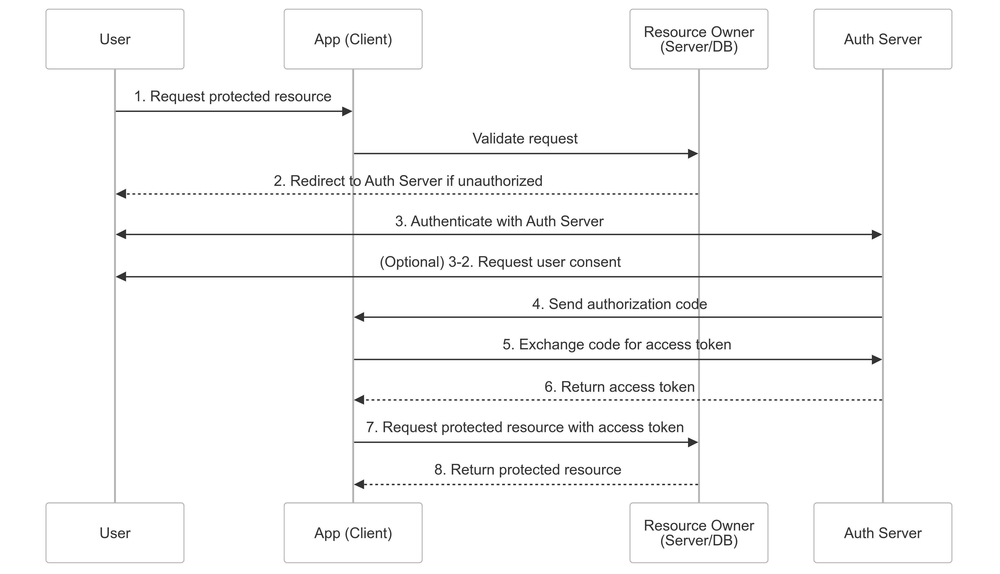
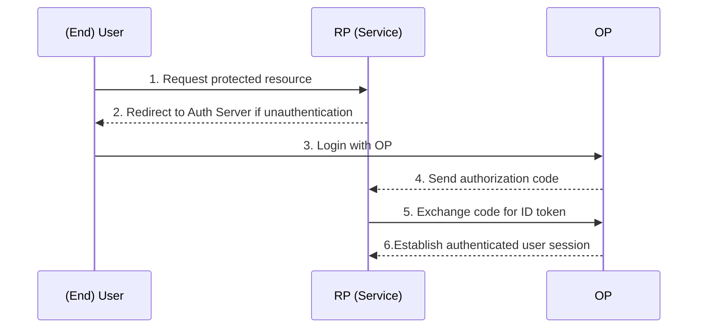
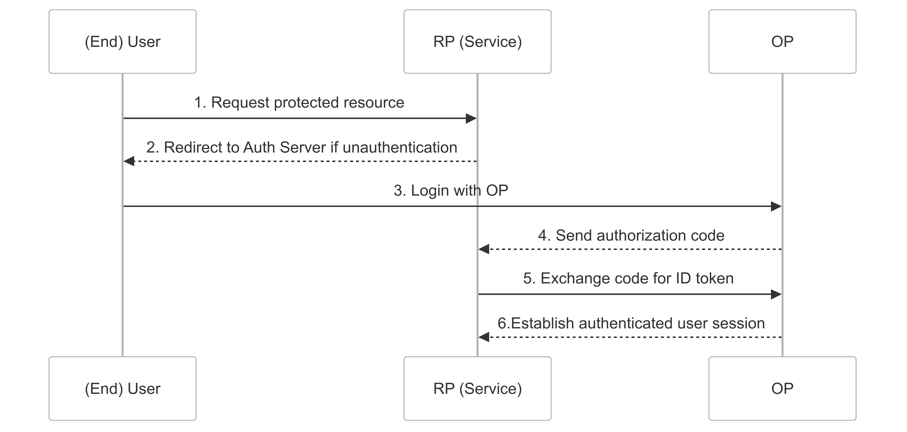

# Authentication ManageMent : OAuth, OIDC

## AuthZ : OAuth 2.0

OAuth 2.0은 Client에서 Authorization(인가)를 획득하기 위하여 사용하는 [개방형 표준 프로토콜](https://datatracker.ietf.org/doc/html/rfc6749)이다. 우리는 이 프로토콜을 활용하여 Client에 login 하려는 유저의 정보를 우리의 resource에 저장하지 않고 외부의 Authorization Server를 활용하여 유저에게 인가를 부여할 수 있다. OAuth 2.0에는 세가지 방법과 현재는 사용하지 않는 2가지 legacy 방법이 있다.

- Client Credentials Flow  
  어플리케이션이 자체적으로 리소스에 접근하는 경우, 즉 어플리케이션이 리소스 Owner인 경우
- Device Flow  
  어플리케이션이 브라우저가 없는 장치에서 실행중이거나 입력이 제한된 경우
  (사용자가 이름과 패스워드 등을 입력하기 어려운 스마트TV 등)
- Authorize Code Flow
- Implicit Flow  
  native 어플리케이션 및 client side 어플리케이션을 위한 간소화된 인증절차
  [보안상 위험](https://blog.weltraumschaf.de/blog/OAuth-Implicit-Flow-Considered-Harmful/)이 있기 때문에 현재는 사용하지 않음
- Resource Owner Password Credentials Flow  
  [비밀번호 처리를 포함하는 절차임으로 타사를 위한 서비스에서 제공되지 않음](https://auth0.com/docs/get-started/authentication-and-authorization-flow/resource-owner-password-flow)

이 중 가장 많이 사용하는 ‘Authorize Code Flow’의 절차는 다음과 같이 표현할 수 있다. access token이 URL에 노출되어 사장된 Implicit Flow와 달리 authorization code를 이용하여 access token의 직접적인 노출을 회피한 것이 Authorize Code Flow의 가장 큰 특징이다. 다이어그램 상에서는 authorization code와 access token을 교환하는 절차를 server가 담당하는 것으로 표현되었으나, IdP 서버를 사용하고 있다면 해당 IdP서버에 본 과정을 일임할 수 있다.

access token을 발급받은 후, Client(App)는 이를 이용하여 Resource Server에 보호된 리소스를 요청할 수 있다. 여기서 중요한 점은 access token이 만료되거나, 취소(revoke)될 수 있다는 점이다. 따라서 Client는 access token이 만료되었을 경우 [refresh token을 이용하여 새로운 access token을 요청](https://datatracker.ietf.org/doc/html/rfc6749#section-1.5)해야 한다. 하지만 refresh token 자체도 보안상의 이유로 장기간 저장되거나 노출되지 않도록 주의해야 한다.

[!note] **Bearer Token** ([RFC-6750](https://datatracker.ietf.org/doc/html/rfc6750))
(OAuth 2.0은 토큰 유형이나 사용 방법에 대해 정의되어 있지 않다.) Bearer 토큰은 통상적으로 사용되는 (access) 토큰 유형이며 일반적으로 HTTP 인가 헤더(Authorization)를 통해 resource server로 전송된다.[break]
**Token Introspection** ([RFC-7662](https://datatracker.ietf.org/doc/html/rfc7662))
OAuth 2.0 access token의 내용은 App(Client)에 노출되지 않는다. 따라서 App은 access token의 내용을 알 수 없다. 클라이언트는 token introspection endpoint를 통해 access token에 대한 정보를 얻을 수 있다.[break]
**Token Revocation** ([RFC-7009](https://datatracker.ietf.org/doc/html/rfc7009))
OAuth 2.0은 access token을 어플리케이션에 발급하는 방법을 고려하지만, 취소하는 방법은 고려하지 않는다. (이는 access token에 대한 만료 처리로 해결한다.)

## AuthN : OIDC 2.0

OAuth 2.0은 인가를 위한 프로토콜이기 때문에 Authentication(인증, Authn)에 대해서는 담당하지 않는다. 일반적으로 인증을 처리하기 위해 OAuth 2.0에 확장된 계층인 OIDC를 사용한다. OIDC는 OAuth 2.0을 기반으로 하면서도 ID Token을 추가로 발급하여 사용자의 신원을 증명하는 역할을 한다. 즉, OAuth 2.0이 "이 사용자가 리소스에 접근할 수 있는 권한이 있는가?"를 묻는다면, OIDC는 "이 사용자가 누구인가?"를 확인하는 역할을 한다.

[!note] SAML vs OIDC[break]OAuth 2.0 + SAML 2.0 조합으로 “인증” + “인가”를 구축하는 것도 가능한 방법이다. ([SAML 2.0은 2005년 OASIS 표준으로 등록되었다.](https://docs.oasis-open.org/security/saml/Post2.0/sstc-saml-tech-overview-2.0.html)) 다만, OAuth와 조합될때 OIDC를 선택하는 것이 조금 더 자연스러운 흐름인데 그 이유는 다음으로 정리할 수 있다. [break][break] OAuth 2.0과 OIDC는 Authorization Code Flow 같은 동일한 인증 흐름을 사용하기에 OAuth 2.0을 사용하고 있다면, OIDC를 추가해도 기존의 흐름을 거의 그대로 유지하면서 인증 기능을 강화할 수 있다. 하지만, SAML은 완전히 다른 인증 흐름을 사용하기 때문에 OAuth 2.0과 혼합하려면 별도의 브리지(Bridge) 시스템이 필요하다.[break][break]데이터 교환 방식에도 차이가 있다. OIDC는 OAuth 2.0을 기반으로 하기 때문에 JWT 형식의 ID 토큰을 사용하는 반면, SAML은 XML 기반이다. (일반적으로 토큰보다 처리 속도가 느리다.)[break][break]또, OIDC는 웹, 모바일, SPA 등 다양한 환경에서 OAuth 2.0과 함께 인증을 제공하도록 설계된 반면, SAML은 주로 엔터프라이즈 웹 애플리케이션(예: 기업용 SSO)에 적합하며, 모바일 및 API 기반 서비스와의 연동이 어렵다.

OpenID Connect Protocol의 Role 구성은 다음과 같다.

- (End) User : OAuth 2.0의 resource owner. 로그인하는 주체
- Relying Party (aka RP) : 사용자 ID를 신뢰하는 Application (웹 서비스, 모바일 앱 등)
- OpenID Provider (aka OP) : 사용자를 인증하는 ID 제공자 (Keycloak, Okta, Google 등)

[OIDC](https://openid.net/specs/openid-connect-core-1_0-final.html)에서는 OAuth 2.0에서 제공하는 access token 외에도 ID Token이 추가로 발급된다. ID Token은 사용자의 인증 정보를 담고 있으며, JWT(JSON Web Token) 형식으로 인코딩된다. 이를 통해 RP(Relying Party)는 사용자가 누구인지 확인할 수 있다. 일반적으로 ID Token에는 사용자의 고유 식별자(sub), 발급자 정보(iss), 만료 시간(exp) 등의 정보가 포함된다.

OIDC는 기본적인 인증 기능을 제공할 뿐만 아니라, 추가적인 기능을 지원하는 여러 확장 사양이 존재한다. 이를 통해 OP(OpenID Provider)와 RP(Relying Party) 간의 동적 구성, 세션 관리, 로그아웃 방식 등을 더욱 세밀하게 조정할 수 있다.

[!note] Extra Spec (OIDC의 주요 확장 기능)
[Discovery](https://openid.net/specs/openid-connect-discovery-1_0.html) App은 OP에 대한 정보를 동적으로 검색한다. (CSRF, CORS ..)
[Dynamic Registration](https://openid.net/specs/openid-connect-registration-1_0.html) App은 OP에 동적으로 자신을 등록한다.
[Session Management](https://openid.net/specs/openid-connect-session-1_0.html) OP와 end-user의 인증 세션을 모니터링 하는 방법과 로그아웃 방법의 정의
[Front-Channel Logout](https://openid.net/specs/openid-connect-frontchannel-1_0.html) Embed Iframe을 통해 여러 App의 Single Signout 메커니즘을 정의
[Back-Channel Logout](https://openid.net/specs/openid-connect-backchannel-1_0.html) back-channel request를 통해 여러 app에서 Single Signout 메커니즘을 정의
