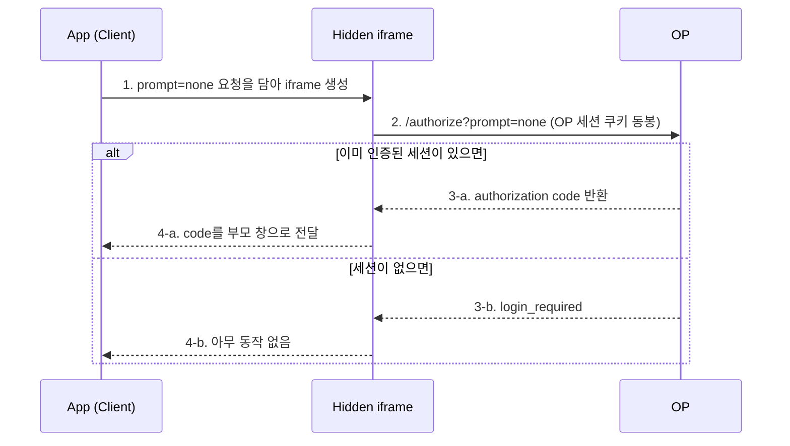
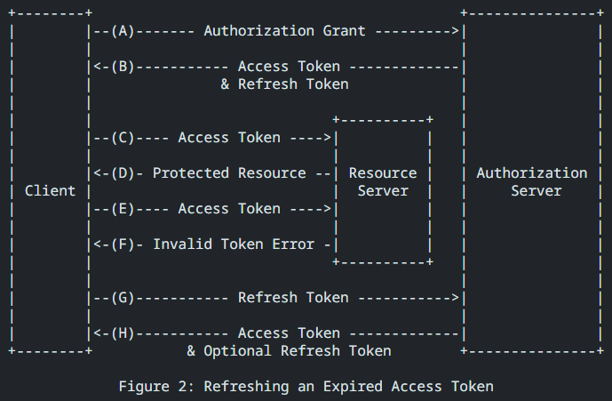

# Authentication ManageMent : Silent Authentication & Shared Session

[지난 글](/article/web/authentication_management_1)에서 OAuth 2.0으로 인가를, OIDC로 인증을 처리하는 흐름을 정리했다. Authorization Code Flow로 access token과 ID token을 발급받고 나면 이론상 인증은 끝난 것처럼 보인다. 그런데 실제로 클라이언트를 만들다 보면 진짜 고민은 그 다음부터 시작된다. access token은 [보안상 짧은 수명을 갖도록 권장](https://www.rfc-editor.org/rfc/rfc9700)되는데, 토큰이 만료될 때마다 사용자를 로그인 페이지로 돌려보낼 수는 없는 노릇이다.

그럼 이 "로그인 되어 있는 상태"를 클라이언트에서 어떻게 유지할 것인가. 이번 글은 그 질문에 대한 정리다.

## Silent Authentication

가장 먼저 만나게 되는 답은 Silent Authentication이다. OIDC의 [authorization endpoint](https://openid.net/specs/openid-connect-core-1_0.html#AuthorizationEndpoint)에 인증을 요청할 때 `prompt` 값을 `none`으로 부여하는 방식이다. 이름 그대로 "조용히" 인증한다 — 사용자에게 로그인 화면 같은 인터페이스 변화를 일절 보여주지 않는다.

- 사용자가 이미 인증된 세션을 갖고 있으면, 요청한 응답(code)을 그대로 반환한다.
- 인증되지 않은 상태라면 `login_required` 류의 에러를 돌려줄 뿐 아무 화면도 띄우지 않는다.

문제는 "이미 인증된 세션"을 클라이언트가 어떻게 확인하느냐다. 통상적인 구현은 hidden iframe을 하나 띄워 그 안에서 authorization 요청을 보내고, 인증 서버(OP) 도메인에 심어진 세션 쿠키로 로그인 여부를 확인한 뒤, 그 결과를 iframe의 context에서 부모 창으로 넘겨받는다.



여기서 결정적인 균열이 생긴다. iframe이 OP의 세션 쿠키를 읽으려면, 그 쿠키는 클라이언트 입장에서 **third-party cookie**다. 그리고 지금 브라우저들은 [third-party cookie를 걷어내는 방향](https://developer.mozilla.org/en-US/docs/Web/Privacy/Guides/Third-party_cookies)으로 움직이고 있다. Safari는 [ITP(Intelligent Tracking Prevention)](https://webkit.org/blog/7675/intelligent-tracking-prevention/)로 이미 오래전에 막았다. 즉 Silent Authentication은 동작 원리 자체가 사라지는 중인 기반 위에 서 있는 셈이다.

한 가지 더 짚어두자. Silent Authentication은 흔히 [Implicit Flow](https://blog.weltraumschaf.de/blog/OAuth-Implicit-Flow-Considered-Harmful/)와 함께 언급되는데, Implicit Flow는 access token이 URL(fragment)에 직접 노출되는 보안 이슈로 이제 권장되지 않는다. 대신 [Authorization Code Flow + PKCE](https://auth0.com/docs/get-started/authentication-and-authorization-flow/authorization-code-flow-with-pkce)가 표준 권장안이다.

[!note] **PKCE** ([RFC-7636](https://datatracker.ietf.org/doc/html/rfc7636), "pixy"라고 읽는다)
Authorization Code Flow에서 [authorization code가 탈취](https://is.docs.wso2.com/en/7.0.0/deploy/mitigate-attacks/mitigate-authorization-code-interception-attacks/)되면 이걸로 access token을 발급받을 수 있다는 문제가 있다. PKCE는 code를 요청한 주체와 token을 요청하는 주체가 동일한지 검증하기 위해 `code_verifier`와 `code_challenge` 두 값을 추가한다.[break]원래 서버 사이드 앱은 token 요청 시 `client_secret`으로 이 문제를 막지만, secret을 안전하게 보관할 수 없는 SPA·모바일 같은 public client에는 그게 불가능하다. PKCE는 secret 없이도 "code를 탈취당해도 쓸모없게" 만드는 장치다.

## Silent Authentication의 대안

Silent Authentication의 기반이 흔들린다면, 로그인 세션 유지는 다른 방법으로 풀어야 한다. SSO(Single Sign-On)까지 고려하며 검토할 수 있는 대안은 대략 세 가지다.

### Refresh Token Rotation

access token은 짧게, refresh token은 상대적으로 길게 두고, access token이 만료되면 [refresh token으로 새 access token을 발급](https://datatracker.ietf.org/doc/html/rfc6749#section-1.5)받는 고전적인 방식이다.



여기에 [Rotation](https://www.rfc-editor.org/rfc/rfc9700#name-recommendations)을 더하면, 새 access token을 받을 때마다 기존 refresh token을 폐기하고 새것으로 교체한다. refresh token이 유출되더라도 한 번 쓰이고 나면 무효가 되므로 재사용 공격을 막을 수 있다.

refresh token은 [http-only + secure 속성을 준 쿠키에 저장](https://stackoverflow.com/questions/57650692/where-to-store-the-refresh-token-on-the-client)하는 것이 일반적이다. 사용자가 브라우저를 껐다 다시 들어와도 쿠키에 남은 refresh token으로 새 access token을 발급해 로그인 세션을 이어간다. [next-auth의 refresh token rotation 가이드](https://authjs.dev/guides/refresh-token-rotation)처럼 라이브러리 차원에서 지원해주는 경우도 많다.

다만 분명한 한계가 있다. 이 방식이 유지해주는 건 **단일 사이트에 대한 자동 로그인**이다. 여러 서비스 도메인을 넘나드는 SSO를 완전히 대체하지는 못한다.

### Backend Session

인증 상태 관리를 아예 백엔드로 넘기는 방식이다. 사용자가 최초 로그인하면 서버가 세션을 생성하고, 그 세션을 근거로 세션 쿠키(혹은 JWT)를 내려준다. 이후 클라이언트는 API로 세션 상태를 확인하며 자동 로그인을 처리한다.

~~결국 Authentication Server를 직접 굴리는 방식과 크게 다르지 않다.~~ 인증 서버(OP)에 인증을 위임하는 그림과는 결이 다르지만, 세션의 소유권을 서버가 명확히 쥐고 있어 로그아웃·만료 제어가 단순해진다는 장점이 있다.

### Authorization Code Flow + PKCE + Shared Session

마지막은 앞서 정리한 Authorization Code Flow + PKCE를 쓰되, **Shared Session**을 얹는 방식이다.

사용자가 클라이언트에서 로그인 버튼을 누르면 인증 서버(OP)로 redirect되고, 로그인에 성공하면 OP 도메인에 세션 쿠키가 설정된다. 이후 Authorization Code로 access token을 요청할 때 이 OP 도메인의 쿠키를 사용한다. 핵심은 이 쿠키를 `SameSite=None; Secure`로 설정하는 데 있다.

[!note] **`SameSite=None; Secure`**
Cross-Origin 요청에서 쿠키를 실어 보내기 위한 설정이다. 기본값인 `Lax`나 `Strict`에서는 Cross-Origin 요청에 쿠키가 붙지 않아 다른 도메인에서 세션을 이어받을 수 없다.[break]그런데 여기서 중요한 차이가 하나 있다. Silent Authentication의 iframe이 막힌 이유는 third-party cookie였는데, Shared Session의 세션 전파는 iframe이 아니라 **브라우저 redirect**로 이루어진다. redirect로 이동한 페이지에서의 쿠키는 first-party로 취급되므로, third-party cookie 정책에서 상대적으로 자유롭다.

바로 이 지점이 Silent Authentication과 Shared Session이 갈리는 핵심이다. 같은 "세션 쿠키로 로그인 상태를 확인한다"는 목표를 두고도, iframe(third-party)이냐 redirect(first-party)냐에 따라 브라우저 정책 앞에서의 운명이 갈린다.

## Shared Session, 그리고 로그아웃

Shared Session으로 자동 로그인의 큰 그림은 잡힌다. 그런데 정작 확신이 안 서는 부분이 두 군데 남는다.

첫째, 서로 다른 서비스 도메인 사이에서 세션이 정말 공유되는가. 가령 `a.example.com`에서 redirect되어 만들어진 OP 세션을, `b.example.com`에서 redirect했을 때도 동일한 세션으로 보고 자동 로그인을 태워주는가. 이게 인증 서버가 제공하는 옵션 덕분인지, 아니면 (Silent Auth 시절처럼) iframe 안에서 token context가 전환되며 벌어지는 일인지 — 솔직히 아직 확신이 없다. 관련해서 명확한 공식 문서를 찾지 못했고, 결국 직접 테스트해봐야 할 영역으로 남겨두었다.

둘째, 로그아웃이다. 자동 로그인이 여러 도메인에 걸린다는 건, 로그아웃도 여러 도메인에 걸려야 한다는 뜻이다. [1탄에서 잠깐 언급했던](/article/web/authentication_management_1) Single Sign-Out 문제가 여기서 현실이 된다. 그리는 그림은 대략 이렇다.

```
1. 사용자가 a.example.com에서 로그아웃 버튼 클릭
2. a.example.com이 OP의 로그아웃 API 호출
3. OP가 a.example.com의 세션을 삭제
4. OP가 b.example.com에도 로그아웃을 요청
5. b.example.com도 로그아웃됨
```

이 4~5번을 구현하는 방법을 몇 가지로 좁혀봤다.

- **Shared Session Revoke** — shared session에 발급된 모든 token을 무효화한다. 다만 클라이언트가 새로고침이나 새 API 요청을 하기 전까지는 이미 손에 쥔 token으로 계속 동작하므로, "즉각적인" 로그아웃은 안 된다. [next-auth의 federated logout](https://github.com/nextauthjs/next-auth/discussions/3938)에 interval check를 더해 주기적으로 세션 유효성을 확인하는 식의 보완이 필요하다.
- ~~FE-Channel Logout~~ — iframe 기반이라, Silent Auth와 같은 이유(third-party cookie)로 이제 기대기 어렵다.
- **[Back-Channel Logout](https://openid.net/specs/openid-connect-backchannel-1_0.html)** — 1탄에서 정리했던 그 스펙이다. OP가 back-channel request로 각 앱에 직접 로그아웃을 통지하니, 브라우저를 거치지 않아 third-party cookie와 무관하게 동작한다.

여기서 ID token이 다시 등장한다. OIDC의 ID token(JWT)에는 세션을 식별하는 `sid` 클레임이 들어있는데, Back-Channel Logout은 바로 이 `sid`(혹은 `sub`)를 키로 "어느 세션을 끊어야 하는지"를 각 앱에 알려준다. 1탄에서 무심코 지나쳤던 ID token의 클레임 하나가, 여기서는 로그아웃 설계의 열쇠가 되는 셈이다.

## 결론? (그리고 다음 글)

정리하면 이렇다. 클라이언트의 로그인 세션 유지에서 정석처럼 여겨지던 Silent Authentication은 third-party cookie의 퇴장과 함께 기반이 무너지고 있고, 그 대안으로 Refresh Token Rotation / Backend Session / Authorization Code Flow + PKCE + Shared Session을 저울질하게 된다. 어느 쪽도 "이거 하나면 끝"인 정답은 아니다. SSO가 필요한가, 도메인이 몇 개인가, 즉각적인 로그아웃이 얼마나 중요한가에 따라 답이 갈린다.

그리고 이 글에는 아직 물음표로 남겨둔 게 있다. Shared Session이 도메인을 넘어 정말 세션을 공유하는지, 로그아웃 전파가 실제로 매끄럽게 동작하는지 — 문서만으로는 끝내 확신이 서지 않았다. 다음 글에서는 이 부분을 직접 붙여보고, 테스트한 결과를 들고 오려 한다. ~~물론 붙여보면 또 새로운 물음표가 생기겠지만.~~
