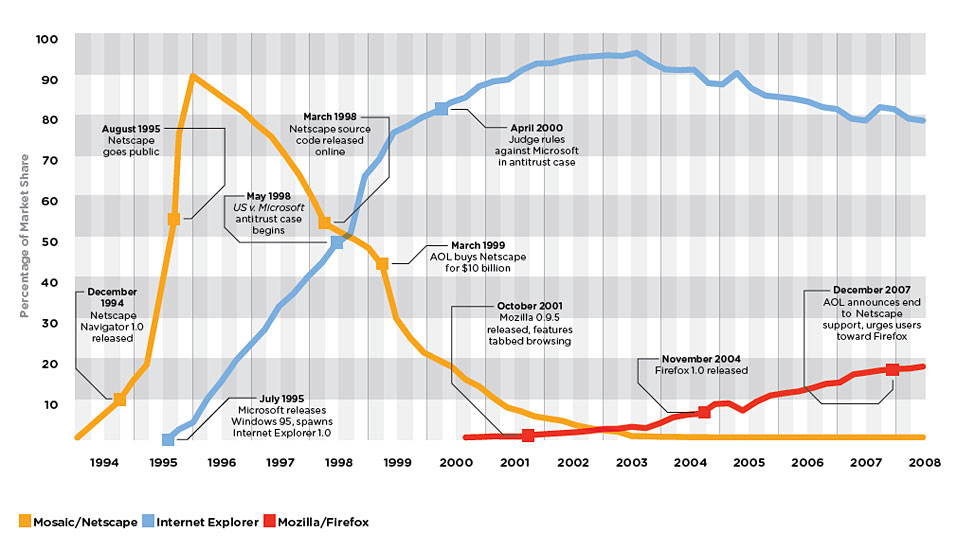
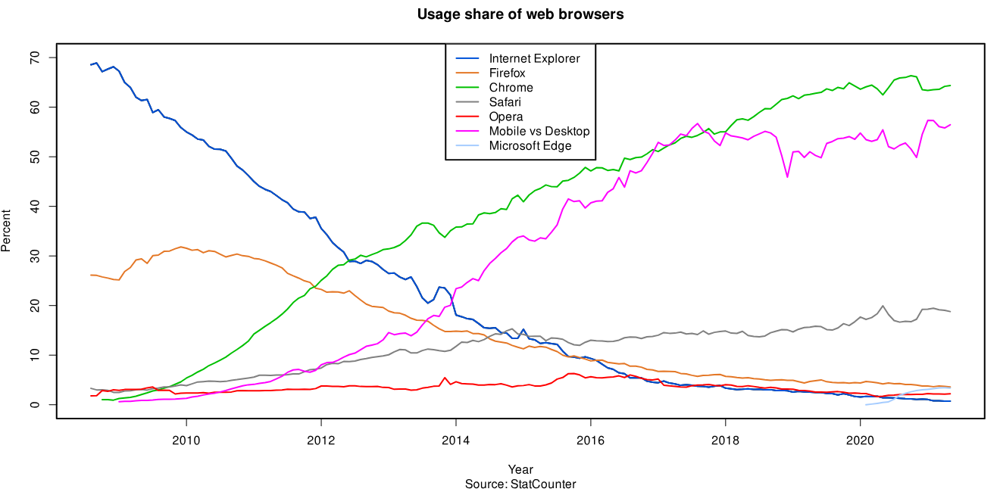
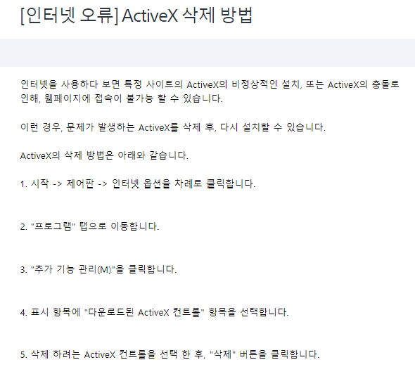

# Browser war

여러분들은 혹시 [캐럿 브라우징](https://support.google.com/accessibility/answer/10129654?hl=ko)에 대해 아는가? 마우스 없이 키보드만을 이용하여 웹페이지를 탐색할 수 있도록 크롬 기준 2023년 9월에 업데이트 된 브라우저의 새로운 웹 탐색 방식이다. 처음엔 선언한 것이 input 태그가 아님에도 캐럿(caret)이 표출되어 당황했던 기억이 있다. 이렇듯 브라우저는 너무 빠르게 변한다. 현재 대부분의 사람들은 크롬에 익숙해져 있지만 미래에는 모를 일이다. 파이어폭스에서는 색약모드를 지원하고 엣지는 Copilot를 본인 브라우저에 내장하여 제공해주고 있다. 아크 브라우저, 브레이브 브라우저 등 이제 우리는 우리 입맛대로 브라우저를 선택할 수 있는 시대에 살고 있다. 이에 2020년 정리했던 브라우저 전쟁에 대한 기록을 2024년 블로그를 시작한 기념으로 다시 작성해보고자 한다!

#### 웹의 태동

벌써부터 모든 브라우저의 빠른 변화속도에 호환성을 신경써야 할 생각에 머리가 지끈거리는데, 이번 시간엔 브라우저의 역사에 대해 돌아볼 예정이다. 브라우저의 역사는 곧 인터넷의 역사이다. 웹의 아버지라 불리는 버너스 리(Tim berners Lee)는 1989년 월드 와일드 웹(www)의 하이퍼텍스트 시스템을 고안하여 개발한 인물이다. (당시 사용한 언어는 파스칼(Pascal)이라고 한다.) 그는 당시 그가 속해있던 CERN 연구소 내 연구원들의 정보 저장 시스템을 개발하였고, 이것이 ‘무엇이든 물어보세요. (Enquire Within Upon Everything)’의 이름을 딴 인콰이어(ENQUIRE)이다.

이후 버너스리는 전 세계에서 인터넷을 게시하고 공유할 수 있도록 현재 웹의 근간이 된 세 가지 핵심 요소를 더 개발해 냈다. 웹페이지를 표시하도록 브라우저에게 지시하는 HTML, 각 정보마다 고유한 경로를 설정해주는 URL, 서로 다른 컴퓨터 간 통신이 가능하도록 설립한 규칙인 HTTP가 그것이다. 이 모든 것들이 무료였기에 인터넷은 발전할 수 있었다. 여기서 한 가지 재밌는 에피소드가 있는데 우리가 보는 URL은 보통 아래와 같은 형식으로 되어 있다. `http://www.test.com` 여기서 ‘//’는 어떤 의미를 지니고 있는 것인지 유추할 수 없는데, 버너스 리가 밝히길 그 이유는 본인의 실수였다. [그는 이 일에 대해 많은 시간과 종이의 낭비였다는 것을 인정하며 사과](https://www.notion.so/2-ca5b23f37b834ec5a068be594fb259cc?pvs=21)했다.

#### 1차 브라우저 전쟁

이제 인터넷이 보편화되었고, 그 인터넷을 위한 violaWWW, midasWWW와 같은 브라우저들이 있었고, 마크 앤드리슨(Marc Lowell Andreeseen)에 의해 브라우저 중 최초로 Window를 지원하고, 그림을 표시할 수 있는 기능을 갖춘 Mosaic가 탄생하게 된다. 모자이크는 이후 전세계 인터넷 이용자의 10%가 사용할 정도로 열풍적인 인기를 이끌게 되고 엔드리슨은 이에 힘입어 넷스케이프를 설립하게 된다. 그 넷스케이프에서 발표한 브라우저가 Mozilla라는 코드명을 가진 Netscape Navigator이다.

이 Netscape Navigator는 당시 브라우저 점유율 90%를 기록하며 브라우저의 영원한 대명사가 될 것만 같았다. 하지만 1995년 마이크로소프트가 인터넷 익스플로러(IE)를 개발하고, Window 운영체제에 IE를 포함시켜 무료로 배포하는 정책을 펼치며 넷스케이프의 시장 점유율을 무서운 속도로 훔쳐오기 시작했다. 이 과정이 우리가 흔히 말하는 1차 브라우저 전쟁이다.

넷스케이프는 IE와 경쟁하며 다양한 시도를 펼쳤는데, 대표적으로는 1997년 Netscape Communicator로 서비스를 개편하며 이메일 클라이언트, IRC 클라이언트와 같은 프로그램을 추가한 점을 들 수 있다. IE는 이에 대항하여 플러그인을 실행하는 AcitveX가 도입되었고 Java와 JavaScript, CSS등 다양한 기능을 브라우저에 도입했다. ~~오 제발.. 그러니까 이때 당시의 AcitveX는 IE가 넷스케이프를 따라잡을 수 있는 훌룡한 기술이었다. 믿기지 않겠지만 사실이다.~~ 이러한 두 회사의 노력은 1996년 80%(넷스케이프), 13%(IE)로 시작한 시장경쟁률에서 1999년 각 46%, 50%로 IE가 시장 점유율을 역전하더니 결국 2002년 IE가 90% 시장 점유율을 확보하면서 서로 다른 결과로 끝맺음을 맺게된다. [이미지 출처](https://habrastorage.org/getpro/habr/post_images/dbe/3a1/8aa/dbe3a18aad1a92aebdb3c423714e8966.jpg)

#### 2차 브라우저 전쟁

한 때 브라우저 시장을 풍미했던 넷스케이프는 유종의 미를 거두고자 본인들의 업적을 오픈소스로 공개하였는데 이에 힘입어 넷스케이프의 일부 개발자들이 넷스케이프의 코드명을 딴 비영리 재단 모질라 파운데이션(Mozilla Foundation)을 설립하게 된다. 그리고 이 모질라에서 개발한 브라우저가 피닉스 브라우저, 파이어 벌드를 거쳐 2004년에 등장한 파이어폭스(Firefox) 되시겠다. 1차 브라우저 전쟁에서 IE의 ActiveX에 대해 잠깐 짚고 넘어갔었는데 이 당시 국내에 인터넷을 이용한 사람들은 알 것이다. 당시 activeX는 서로 다른 IE 버전끼리 호환이 안되던 환경에 더불어 취약한 보안이란 문제점이 있었는데 이를 해결하기 위해 보안을 위한 activeX가 등장하는 기염을 토하고 있었다. ~~activeX는 activeX로 처리한다. 이게 바로 이엑제엑?~~ 이 때의 사용자들은 브라우저에 지쳤다.

[!note]적어도 난 공인인증서를 위한 activeX를 100번도 넘게 지웠다가 깔았으며 새로운 activeX가 설치될 때 기존의 activeX와 충돌을 일으키는 상황을 10번도 넘게 봤을 것이다.

[이미지 출처](<https://en.wikipedia.org/wiki/File:Usage_share_of_web_browsers_(Source_StatCounter).svg>) 이 때 사파리의 가벼운 웹키트 엔진을 기반으로 발전시켜 Blink Browser 엔진을 만들고 Javascript 호환성까지 해결한 v8 엔진을 도입한 Chromium Project를 오픈소스로 발표한 회사가 있었으니 바로 구글이다. 그리고 그 구글이 발표한 브라우저가 바로 Chrome이다. 모질라가 2000년부터 2010년까지 꾸준히 쌓아왔던 30%의 점유율은 크롬이 등장한지 불과 3년 만에 돌파했고, 2012년 5월을 기점으로 IE의 점유율마저 따라잡게 된다. 이는 IE와 비교하여 압도적으로 높인 편의성과 속도를 제공했기 때문이다. ~~개인적인 감정으론 개발자 도구를 등장시켜준 크롬이 더 압도적으로 승리했어야 한다고 생각한다.~~ 2014년 8월, MS는 IE의 지원 중단을 선언하고 야심차게 새로운 브라우저인 Edge를 공개했으나, 윈도우 10에서만 사용할 수 있는 문제와 기존 브라우저와의 호환성 실패로 세대 교체의 실패로 평가받고 2차 브라우저의 승자는 크롬이 차지하게 되었다. 여담으로 2020년 9월 3일, 당시 시점으로 시장에 등장한지 3년이 된 [네이버의 웨일이 IE의 국내 점유율을 앞서는 것](https://news.heraldcorp.com/view.php?ud=20200903000579)으로 국내에서도 IE는 구 시대의 유물이 되었다. 이와 함께 한때는 편의성의 상징에서 “인터넷 오류”가 된 ActiveX도 함께 사라졌다. 아래는 [소니의 고객지원 캡쳐](https://www.sony.co.kr/electronics/support/articles/S500077927)이다.

#### 3차 브라우저 전쟁?

작년 [구글과 MS 3차 브라우저 전쟁 승자는?](https://www.mk.co.kr/news/columnists/10708863) 이라는 기사를 읽은 적이 있는데, 내용은 기존의 브라우저 전쟁을 설명하고 생성형 인공지능의 등장으로 발발한 3차 브라우저 발발이었다. 사실 이리저리 자료를 찾아봐도 [3년전 레딧에서 3차 브라우저 전쟁은 언제 일어날까와 같은 토론](https://www.reddit.com/r/browsers/comments/ry09vu/when_will_third_browser_war_start/)이나 [iOS 14의 출시부터 사파리 브라우저 이외에 기본 브라우저를 선택할 수 없는 Apple을 중심으로 3차 브라우저 전쟁이라 표현한 아티클](https://mobiledevmemo.com/the-new-browser-wars/)도 확인할 수 있었지만 본격적으로 새로운 전쟁에 도입했다고 보기는 어려울 것 같다. 사실 지금의 상태는 2024년 1월 64%의 점유율을 차지하고 있는 크롬의 우위상태 혹은 서두에 말했듯이 달이 바뀔때마다 새롭게 브라우저별로 기능이 추가되는 춘추전국시대로 보는 것이 맞지 않을까. 사실 브라우저와 관련하여 내가 가지고 있는 최대의 관심사는 [WebAssembly](https://developer.mozilla.org/ko/docs/WebAssembly/Concepts)이다. 이제 브라우저가 .html / .js / .css의 확장자만 읽을 수 있는 시대에서 벗어나 새로운 국면으로 들어가지 않을까? 다음에 기회가 된다면 어쩌면 프론트엔드 기술의 흐름을 JS에서 RUST로 바꿀 수 있을만큼 잠재력을 지닌 웹 어셈블리에 대해 이야기해보고자 한다.
