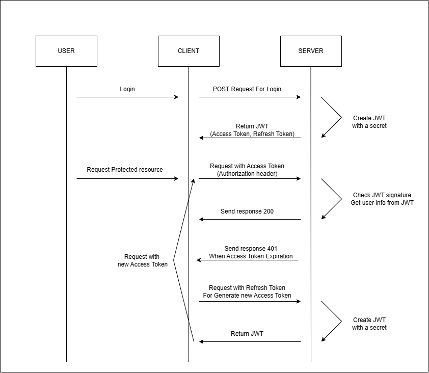

# axios instance를 활용하여 JWT 로직 처리하기

이번 시간에는 멘토링을 진행하면서 수강생분들에게 가장 많이 받는 질문 중 하나인 프론트단에서 “JWT”를 통한 authentication을 알아볼 예정이다. 간단하게 [JWT](https://jwt.io/)에 대해 알아보면 JWT는 JSON 객체를 사용해 **정보를 안전하게 전달**하기 위한 **토큰**이다. 클라이언트와 서버 간의 인증 및 정보 교환에 자주 사용되는데, JWT는 서명을 포함하고 있어 데이터가 변조되지 않았음을 검증할 수 있다. 기존의 고전적인 Session based authentication과는 다르게 인증에 필요한 정보가 클라이언트에 저장되기 때문에 스니핑 등의 보안 상 위험이 있다. 이를 해결하기 위해 JWT에서는 코튼을 통상적으로 2중으로 나누어서 관리하는데 그것이 accessToken과 refreshToken이다.

먼저 accessToken은 유저의 정보를 담고 있는 토큰으로 인증과 인가에 사용된다. 로그인 시 발급되어 클라이언트 에 저장되고, api 요청 시 header에 해당 token을 같이 보내게 되면 토큰에 담겨진 유저의 정보를 확인하여 어떤 유저가 요청하였는지를 서버에서 확인할 수 있다. 앞서 말했듯 JWT 방식은 토큰이 탈취되어 다른 사람이 사용될 위험이 있는데 이를 위해 accessToken은 짧은 유효기간을 설정한다. 보통 30분 혹은 1시간 정도로 설정되어 있는데 해당 시간이 지나게 된다면 accessToken은 유효하지 않은 것으로 처리되어 다음 인증, 인가에 사용할 수 없는 로직이다.

accessToken이 로그인 시 발급되고 그 유효기간이 30분이라 가정한다면 유저는 30분마다 로그인을 다시 해주어야 하는 번거로운 상황에 직면할 수 있다. 그것을 해결해주기 위한 것이 refreshToken이다. refreshToken은 새로운 accessToken을 발급해줄 때에 사용되는 token이다. 마찬가지로 로그인 할 때 새로운 refreshToken을 발급받으며 accessToken이 만료되었을 때 이전에 발급받은 refreshToken을 통해 새로운 accessToken을 발급받는 방식이다. refreshToken을 통해 새로운 accessToken을 발급받아야 함으로 accessToken보다 긴 유효기간을 지닌다. (통상적으로 14일) accessToken과 마찬가지로 refreshToken도 탈취의 위험성이 있다. 이를 방지하기 위해 refreshToken을 1회용으로 사용할 수 있도록 RTR을 도입하거나, refreshToken은 서버의 캐시에 저장하여 강제로 만료시키는 안전장치를 추가해주는 로직등을 고려해볼 수 있다.



이렇게 간단하게 JWT의 원리와 각 토큰의 역할을 알아보았는데 동작되는 로직을 확인해보면 위 이미지처럼 정리할 수 있다. 우리는 로그인 이후 모든 api 요청마다 accessToken을 header에 보내줘야 하고, 만약 accessToken이 만료되었을 경우 만료된 요청을 저장한 이후, refreshToken을 통해 새로운 accessToken을 발급받고 만료되었던 요청을 다시 보내야한다. 이를 각각의 API별로 모두 핸들링할 수 없기에 axios에 [instnace](https://axios-http.com/docs/instance)를 생성하여 자동화를 꾀해볼 수 있다.

```tsx
const instance = axios.create({
  baseURL: "https://YOUR-SERVER-DOMAIN",
});
```

axios의 create method를 통해 새로운 instance를 생성할 수 있다. 여기에 [interceptor](https://axios-http.com/docs/interceptors)를 정의하여 request, 요청의 전단계와 response, 응답의 후단계에 동작을 정의할 수 있다. 첫번째로 request의 전단계를 정의해보자. 해당 단계에서는 accessToken을 가져와 요청의 header에 삽입하여야 한다.

```tsx
instance.interceptors.request.use((config) => {
  const { accessToken } = getYourAccessToken();
  if (accessToken) {
    config.headers.Authorization = `Bearer ${accessToken}`;
  }
  return config;
});
```

로그인, 회원가입과 같은 동작에선 저장되어 있는 accessToken이 없기에 accessToken이 있을 때에만 header의 `Authorization` 에 정의한다. 앞에 prefix되는 “Bearer”는 인증타입으로 JWT 통신에서 사용되는 표준 규격이다. `getYourAccessToken` 은 localStorage 혹은 cookie에 저장되어 있는 accessToken을 가져오는 로직이다. 프로젝트에 따라서 적절한 방법으로 토큰을 가져오자. 다음으로는 응답 후처리를 처리하는 로직이다. 기본적으로 응답이 성공했을 때에는 달리 후처리 할 로직이 없다. accessToken이 만료되었을 경우 새로운 accessToken을 발급받는 로직을 정의하여야 하는데, 지금의 예시에서는 status가 401일 때를 해당 상황으로 가정했다. API의 설계에 따라 로그인이 필요한 API 요청에 acccessToken이 없는 경우에도 401 응답을 받을 수 있는데, 보다 엄밀히 구분짓고 싶다면 error message등을 추가로 확인해도 좋다.

```tsx
instance.interceptors.response.use(
  (response) => response,
  // 에러가 발생했을 시
  async (error) => {
    // 에러가 발생한 request를 임시 저장한다.
    const originalRequest = error.config;

    // 401 에러가 아닌 에러는 요청 실패임으로 reject한다.
    if (error.response?.status !== 401) {
      return Promise.reject(error);
    }

    try {
      const refreshToken = getYourRefreshToken();
      if (!refreshToken) throw new Error("Invalid refresh token");

      // Refresh Token을 사용하여 accessToken재발급 요청
      // body 혹은 header에 refreshToken을 전달
      const response = await axios.post("https://YOUR-API-END-POINT", {
        refreshToken,
      });

      const newAccessToken = response.data;
      // 응답받은 accessToken으로 저장
      saveAccessToken(newAccessToken);
      // 재발급된 accessToken으로 원래 요청 재시도
      originalRequest.headers.Authorization = `Bearer ${newAccessToken}`;
      return instance(originalRequest);
    } catch (error) {
      console.error(error);
      // refreshToken이 없거나, refreshToken을 통해 새로운 accessToken 생성 실패
      // token이 유효하지 않다고 판단, 로그아웃 시킨다.
      clearUserAuth();
      window.location.href = "/login";
    }
  }
);
```

에러가 발생했을 때의 request는 `originalRequest` 에 저장되어 있고, 새롭게 발급받은 accessToken을 저장하고 그 토큰으로 다시 요청을 보내는 로직이다. 만약 RTR이 도입되어 있다면 위 로직에서 refreshToken을 저장하는 로직을 추가하여 사용하면 된다. 지금의 예시에서는 refreshToken이 없거나 새로운 accessToken을 발급받는 데에 실패한다면 로그아웃되도록 처리해놓았는데, 이는 진행하고 있는 프로젝트, 서비스의 요구사항에 따라 알맞게 처리하면 된다.

여기서 한 가지 더 로직을 발전해 볼 여지가 있는데 accessToken과 refreshToken이 만료된 경우 어차피 API 요청은 실패할 것이란 사실이다. 즉 굳이 API 요청을 보내지 않고, 이미 만료된 토큰을 가지고 있다면 곧바로 새로운 accessToken을 발급하거나 로그아웃 처리하는 방법들을 적용해볼 수 있다. 토큰의 유효기간을 확인하기 위해 [jwt-decode](https://www.npmjs.com/package/jwt-decode) 라이브러리를 사용해보자. 디코딩된 값의 ext를 통해 현재 토큰의 유효기간을 확인할 수 있다. 해당 로직을 추가하면 코드는 최종적으로 다음과 같다.

```tsx
const getNewAccessToken = async (refreshToken: string) => {
  const response = await axios.post("https://YOUR-API-END-POINT", {
    refreshToken,
  });

  const newAccessToken = response.data;
  saveAccessToken(newAccessToken);
  return newAccessToken;
};

instance.interceptors.request.use(async (config) => {
  const { accessToken } = useAuthStore.getState();
  if (!accessToken) {
    return config;
  }

  const current = Math.floor(Date.now() / 1000);
  const decoded = jwtDecode(accessToken);
  if (decoded.exp > current) {
    config.headers.Authorization = `Bearer ${accessToken}`;
  } else {
    try {
      const refreshToken = getYourRefreshToken();
      const newAccessToken = await getNewAccessToken(refreshToken);
      config.headers.Authorization = `Bearer ${newAccessToken}`;
    } catch {
      clearUserAuth();
      window.location.href = "/login";
    }
  }
  return config;
});

instance.interceptors.response.use(
  (response) => response,
  async (error) => {
    const originalRequest = error.config;

    if (error.response?.status !== 401) {
      return Promise.reject(error);
    }

    try {
      const current = Math.floor(Date.now() / 1000);
      const refreshToken = getYourRefreshToken();
      if (!refreshToken) throw new Error("Invalid refresh token");

      const decoded = jwtDecode(refreshToken);
      if (decoded.exp < current) throw new Error("Refresh Token expired");

      const response = await axios.post("https://YOUR-API-END-POINT", {
        refreshToken,
      });
      const newAccessToken = response.data;
      saveAccessToken(newAccessToken);

      originalRequest.headers.Authorization = `Bearer ${newAccessToken}`;
      return axiosAuthInstance(originalRequest);
    } catch {
      clearUserAuth();
      window.location.href = "/login";
    }
  }
);
```

이번 시간엔 axios의 instnace를 활용하여 프론트 단에서 jwt를 핸들링하는 방법에 대해 알아보았다. 해당 로직들을 바탕으로 본인이 진행하고 있는 프로젝트에 맞게 변경하여 사용하자. 만약 next를 사용하고 있다면 next-auth와 같은 authentication 라이브러리를 사용하는 것도 좋은 선택이다.
