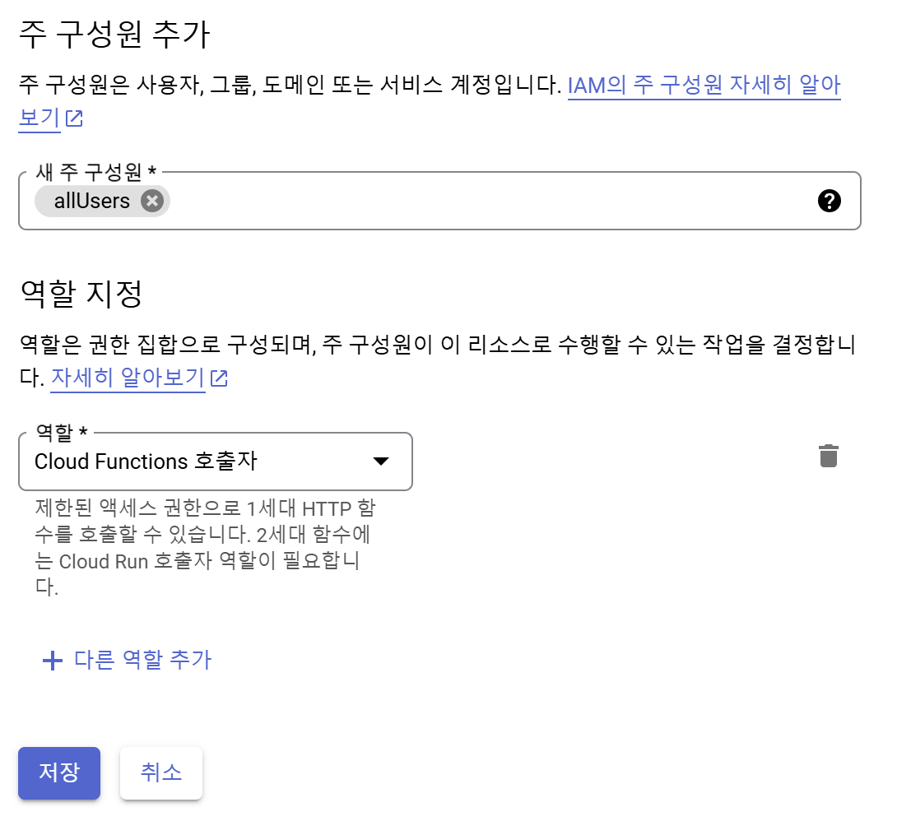

# Firebase로 Next 프로젝트 배포하기 : GCP setting / CI/CD

[이전 게시글](https://pancodev.io/article/next/next-deploy-with-firebase-1)에서 준비된 프로젝트를 이제 firebase hosting으로 배포해보자. firebase hosting이 처음이라면 먼저 [이 문서](https://firebase.google.com/docs/hosting/quickstart)를 읽기를 권장한다. 또, 우리가 배포하고자 하는 프로젝트는 SPA가 아닌 웹 어플리케이션이기 때문에 [이 설정](https://firebase.google.com/docs/hosting/frameworks/frameworks-overview)이 필요하다. 요약하자면 아래와 같다. `use` 와 `--only` 옵션은 본인 프로젝트의 상황에 맞추어 설정해주자.

```bash
(firebase authentication 만료 시) firebase login --reauth
(최초 1회) firebase init hosting
firebase experiments:enable webframeworks
optional: firebase use project-alias
firebase deploy --only hosting:hosting-alias
```

#### Cloud Functions Authentication

이렇게 최초로 firebase hosting을 진행하게 되면 그에 따른 gcp project가 생성될 것이다. 아마 자동으로 설정이 되는 것으로 짐작하지만 혹시 server-side 단에서 404에러가 발생한다면 clud run funtions탭에서 권한을 추가해주면 된다. 추가해주고자 하는 구성원은 **allUsers**, 추가해야 할 권한은 **Cloud Functions 호출자**이다.



[!note][Cloud Functions탭이 Cloud Run탭으로 통합이 될 예정](https://cloud.google.com/blog/products/serverless/google-cloud-functions-is-now-cloud-run-functions?hl=en)이다. 혹시 통합이 된 이후라면 Cloud Run 탭에서 권한을 찾아서 설정해주자.

#### Get IAM Service Account Authentication

이제 firebase deploy 동작을 CI/CD에 통합할 순간이다. CI/CD 환경에서 항상 개발자의 firebase authentication을 가져올 수는 없음으로 배포 권한을 획득해야 한다. Google Cloud로 이동하여 **IAM 및 관리자**메뉴의 **서비스 계정**탭으로 이동하자. 이제 필요한 권한을 부여한 계정을 생성하고 그 계정의 key를 json파일로 발급받으면 되는데, 어떤 권한을 부여해야 하는지는 이 [아티클](https://medium.com/@jankir/how-to-deploy-firebase-functions-in-ci-using-a-service-account-key-with-801be78251cf)이 잘 정리를 해놓았다. 나의 경우는 admin 권한을 가진 서비스 계정이 이미 존재하였기에 그 계정의 key파일을 그대로 사용했다. 이후 GCP에서 하기 3개의 API에 대한 사용 신청을 진행하자.

- [Eventarc API](https://console.cloud.google.com/apis/library/eventarc.googleapis.com)
- [Cloud Run Admin API](https://console.cloud.google.com/apis/library/run.googleapis.com)
- [Identity and Access Management (IAM) API](https://console.cloud.google.com/apis/library/iam.googleapis.com)

이제 발급받은 Key파일을 사용하여 배포에 도구에서 적절한 파이프라인을 호출해주면 된다. 필자의 경우 bitbucket을 사용중인데 bitbucket은 [key파일을 base64로 인코딩해서 사용](https://community.atlassian.com/t5/Bitbucket-questions/BitBucket-Firebase-Pipeline-error/qaq-p/1995834)해야 한다. 각자 선택한 서비스의 사용법을 잘 읽고 알맞제 설정해주도록 하자.

- github : [action-hosting-deploy](https://github.com/FirebaseExtended/action-hosting-deploy)
- bitbucket : [atlassian/firebase-deploy](https://bitbucket.org/atlassian/firebase-deploy/src/master/)
- etc…

#### Call Firebase-tools in pipeline

위와 같이 세팅하여 잘 사용하고 있는데, 8월 20일 다음과 같은 에러를 만났다. 사용하였던 파이프라인은 `atlassian/firebase-deploy:5.1.0` 이다.

```
Error: Failed to parse build specification:
- FirebaseError Unexpected key extensions. You may need to install a newer version of the Firebase CLI.
✖ Deployment failed.
```

이 당시 에러에 대한 원인을 파악하지 못하였고, `atlassian/firebase-deploy:5.1.0` 와 관련된 이슈라 추측만 하였는데 어쩔 수 없이 해당 파이프라인을 걷어내고 내 파이프라인 내부에서 firebase deploy를 직접 진행하기로 했다. **Get IAM Service Account Authentication**과정에서 발급받은 key파일을 firebase cli에서 사용할 수 있도록 환경변수로 등록하였고 firebase를 사용하기 이전에 `GOOGLE_APPLICATION_CREDENTIALS` 이름으로 export하여 사용하였다. 이와 관련된 사항은 [이 문서](https://cloud.google.com/docs/authentication/application-default-credentials)에 잘 정리되어 있다. 최종적으로 적용된 파이프라인은 다음과 같다.

```yaml
/* ... */
  - step:
      name: Deploy to Firebase
      caches:
        - node
      script:
        - export GOOGLE_APPLICATION_CREDENTIALS="./loplat-dmp-799f4-8fee5e4297e7.json"
        - firebase experiments:enable webframeworks
        - firebase use your-project-alias
        - firebase deploy --only hosting:your-hosting-alias
/* ... */
```

이렇게 firebase-cli를 직접 실행하고자 한다면 아래 두 GCP API에 대한 허용이 필요하다.

- [Firebase Extensions API](https://console.cloud.google.com/marketplace/product/google/firebaseextensions.googleapis.com)
- [Cloud Billing API](https://console.cloud.google.com/marketplace/product/google/cloudbilling.googleapis.com)

이때까지 Vercel이 자동으로 제공해주는 서비스(이미지 최적화 등)를 이관하지 않은 상태로, 단순히 우리의 Next App을 Firebase에 배포하는 토대를 설계해 보았다. 단순히 Next App만 이관하는 작업이었으면 간단했겠지만 주요 라이브러리들이 (특히 next-auth) firebase deploy 환경에서 에러를 뱉는 바람에 1주일정도 gcp cloud log만 살펴보았던 것 같다. 아직 최적화 할 여지가 많이 남아 있다. 기회가 된다면 그것도 블로그에서 다뤄보도록 하겠다.
