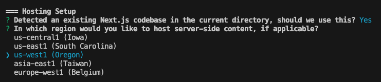

이번주 화요일 회사에 있는 모든 프론트엔드 배포(GCP Cloud Run / Cloud Functions) region을 asia-northeast3,'한국'으로 변경했다. 기존에는 asia-east1, 대만으로 설정되어 있었는데 기존에 모든 프로젝트가 대만에 배포된 이유는 전적으로 내 잘못이다. 보다 자세히 설명하자면 [vercel로 배포하던 프로젝트들을 firebase로 이관](https://pancodev.io/article/next/next-deploy-with-firebase-1)하는 작업을 진행하면서 firebase를 init할 때 region을 잘못 입력해주었기 때문이다.

위 이미지는 [firebase cli](https://firebase.google.com/docs/cli)를 통해 최초 프로젝트를 init할 때 region을 선택하는 옵션이다. ~~아마 처음에 프로젝트를 만들 때 딴에는 그나마 가까운 asia-east1을 골랐나보다.~~ [firebase hosting을 통해 next 프로젝트를 배포](https://firebase.google.com/docs/hosting/frameworks/nextjs?_gl=1*tlswz1*_up*MQ..*_ga*MTI0MTUyMzU4MC4xNzM0NTIzNzg5*_ga_CW55HF8NVT*MTczNDUyMzc4OS4xLjAuMTczNDUyMzc4OS4wLjAuMA..)하려면 요금제가 braze여야 하기 때문에 [서울이 포함된 price2 region](https://cloud.google.com/run/pricing?hl=ko#tier-2)을 선택할 수 있다. 굳이 대만 region을 사용할 필요가 없기에 프로젝트의 프로덕션 배포가 있을 때마다 하나씩 region을 변경해 새롭게 cloud run을 배포하였고 그 작업이 어제 종료되었다.

next 프로젝트는 vercel에 친화적이기에 firebase 배포와 관련된 자료와 문서가 많이 부족하였고, 딴에는 공부하면서 했던 작업이지만 결국 이렇게 구멍을 만들게 되었다. **조금 더 google 공식문서를 탐독하면서 작업을 진행했더라면 이 사단을 만들지 않았을 텐데**, 아쉬움을 곱씹어본다.
