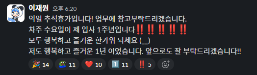

### 두번째 회사에서의 1년

2024년 9월, 두번째 회사이자 현 회사에서 1년의 근무연속을 채웠고, 현재 1년 4개월차에 접어들었다. 언젠가 링크드인에서 "새로운 조직에서 융화를 위해 입사 후 1년 동안은 기존 팀원들에게 싫은 소리를 하지 않는다"라는 논지를 읽어본 적이 있는데, 비단 그런 이유 뿐 아니라 이제 현 회사에 충분히 ~~오래 전에~~ 적응하였고 1인분 몫을 해내고 있다고 자부할 수 있다. 전 회사와 비교하여 조금 더 Service Developer다운 면모를 키울 수 있었던 1년이었다. 단순히 UI를 개발하는 작업 이외에 배포 환경에 대해 깊게 탐구해보는 시간을 가질 수 있었고 최근에는 langChain을 활용하여 AI Chat을 만드는 경험도 다질 수 있었다. Front, Back 등의 경계를 벗어나 "서비스"를 개발하는 개발자가 되고 싶단 꿈이 있는데 그 꿈에 한 발자국 가까이 다가갈 수 있었던 일년이었다.

### 다시 시작한 멘토링

22년부터 시작한 부트캠프 멘토링을 1년 정도 휴식을 가지고 24년 10월부터 다시 시작하였다. 개인적으로 "내가 누군가를 가르칠 자격이 있나?" 스스로 되묻는 편인데, 아직은 요원하다고 생각한다. 특히나 부트캠프의 특성 상 수강생분들 대부분 진로를 변경하고, 직업을 가지기 위하여 참여하는 경우가 대부분이기에 그 부담감은 더 할 나위 없이 크다. 그럼에도 과정 내에서 내가 할 수 있는 역량을 십분 발휘하기 위해 애쓰고 있고, 멘토링 만족도 조사에 높은 점수를 받으면 다시 새롭게 동기를 얻어 열정적으로 진행하고 있다. 강의의 경우도 같은 창업을 병행했던 2022년 3월 이후로 새로운 강의를 찍지 못하고 있는데, 2025년에는 3년동안 내가 성장한 만큼 조금 더 IT 문화에 이바지 할 수 있도록 신경써보아야겠다

### 투자와 연금

투자는 100% 안전할 수 없기에, 결국 손실의 부담을 가진다고 생각한다. 예전에는 이러한 시간에 나의 연봉을 올리는 방향을 생각을 했는데 살다보니 정답이 아니란 생각이 들었다. 항상 적금을 통해 차곡차곡 월급을 모으는 데에서 벗어나 ISA 계좌를 만들고 ETF를 몇개 골라 담았다. ~~아직 주식이나 코인 같은 것을 할 용기는 나지 않는다. 미국 ETF는 신이라던데..~~ 아직 이쪽 세계는 낯설기만 하다. 또 세액공제의 혜택이 있다고 해서 CMA 계좌에 있는 600만원을 연금계좌를 만들고 그곳으로 옮기고 마찬가지로 ETF에 투자를 진행했다. 나중에 계산을 해보니 중소기업 취업자 소득세 감면 제도의 혜택을 받아 연금계좌 없이도 내가 낸 세금을 전부 돌려받을 수 있더라. ~~내 600만원.. 물론 어디로 사라지는 건 아니지만~~ 올해로 30살이 되었기에 이제 조금 더 제태크에 관심을 가져야겠다. 내 미래를 차근차근 준비해보자.

### 블로그와 스터디

사실 가장 급격하게 변화를 겪은게 [스터디 활동](https://pancodev.io/small_talk/2024/my-first-study)과 블로그를 시작한 것 같다. 블로그의 경우에도 스터디원 사람들이 하나둘 작성하기에 엉겁결에 따라 시작하게 되었는데 지금은 어느정도 궤도에 올라 내 좋은 취미가 된 것 같다. 처음에는 양질의 글로만 블로그를 채우고 싶다는 욕심에 어떤 글을 써야 할지 고민하는 시간이 길어져 주객이 전도되었다는 느낌을 받았는데, 이제는 내 지식의 창고라 여기고 있다. 내 블로그에서 가장 많이 지식을 얻어가는 사람은 아마 나일 것이다. 예전에 내가 무슨 생각으로 어떻게 작업을 했었는지 궁금할 때 내 블로그를 내가 찾고 있다.

**2024년은 나에게 쉼표같은 한 해였다.** 이때까지 앞만 보고 달려오느라 놓쳤던 많은 것들을 되돌아보고 살펴볼 수 있는 시간이었다. 도움닫기를 크게 내딛었으니 2025년에는 더욱 정진할 수 있도록 의지를 다잡는다.
