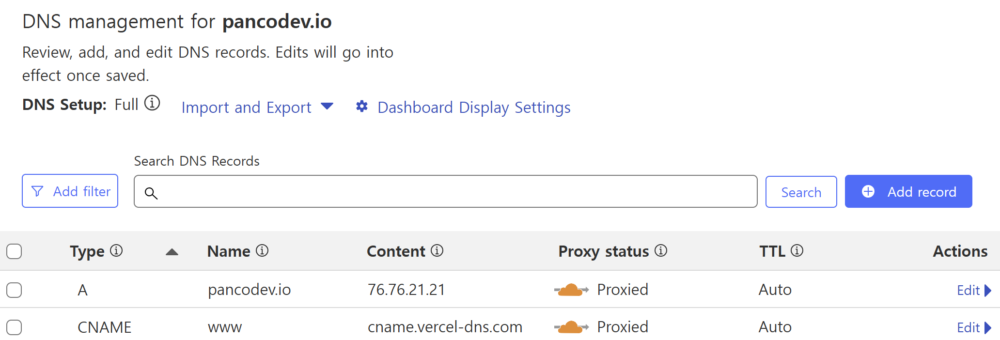
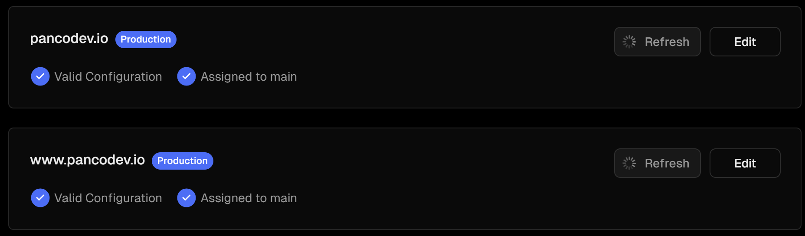
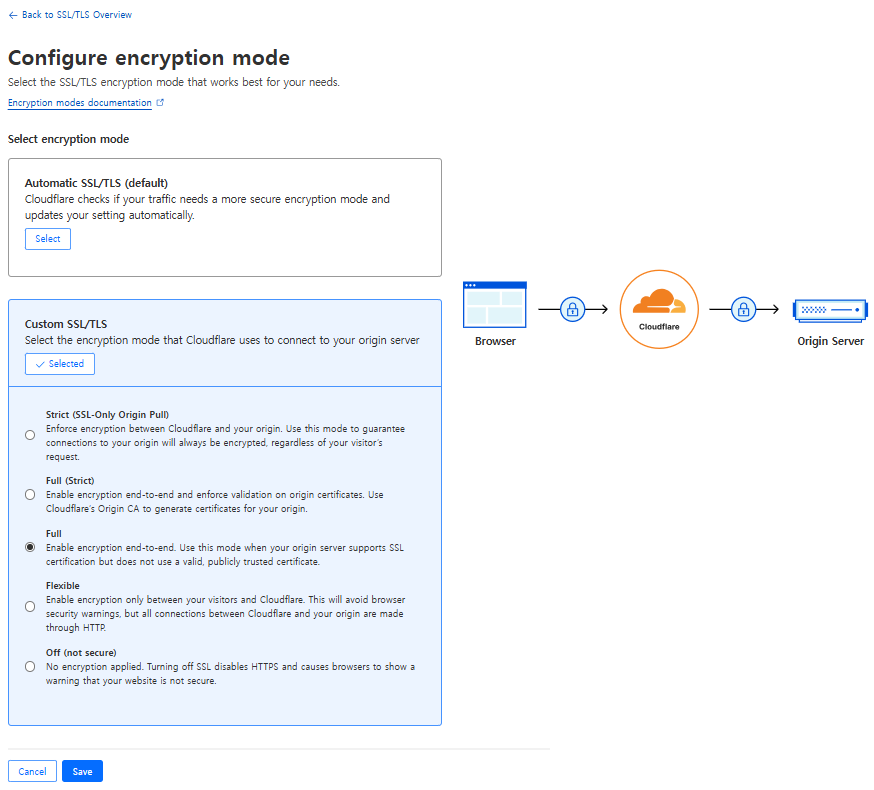

# Vercel + Cloudflare 환경에서의 “err_too_many_redirects” 해결

Vercel은 DNS서비스를 제공하지만 이미 Cloudflare로 DNS를 관리하고 있다면 이를 Vercel에 등록할 수 있다. Cloudflare를 통해 DNS 세팅을 한 도메인을 Vercel에 연결하면 `err_too_many_redirects` 에러를 만날 수 있다. 이 해결 방법은 단순한데, [Vercel의 공식문서](https://vercel.com/docs/integrations/external-platforms/cloudflare)를 확인해보면 Cloudflare의 Proxy status를 off해 “DNS only”상태로 전환하거나, SSL/TLS탭에서 Configure encryption mode 설정으로 이동하여 값을 Full로 변경해주면 된다.

그런데 왜 `err_too_many_redirects` 에러가 발생하고, 왜 위와 같은 방식으로 에러를 해결할 수 있을까? 그 이유를 알려면 SSL/TLS 설정에 대해 알 필요가 있다. SSL/TLS는 웹사이트와 사용자 간의 데이터 전송을 안전하게 보호하는 중요한 프로토콜로서 개인정보를 안전하게 전송하는 것을 목표로 한다. 우리가 브라우저에 URL을 입력하게 되면 브라우저는 해당 URL에 대한 IP 주소를 찾기 위해 DNS 서버에 요청을 보내게 된다. 브라우저가 DNS 서버로부터 IP 주소를 받아오게 되면 해당 서버에 [TCP/IP 연결](https://www.cloudflare.com/ko-kr/learning/ddos/glossary/tcp-ip/)을 시작하게 된다. 이후 TCP 연결이 성공하면 클라리언트는 [SSL/TLS 핸드쉐이크](https://www.cloudflare.com/ko-kr/learning/ssl/what-happens-in-a-tls-handshake/)를 시작한다. 이 과정에서 SSL/TLS는 서버 인증, 세션 키 생성 및 암호화등을 통해 데이터 전송의 안정성을 확보하게 된다.

위 과정에서 원본 서버(Vercel)가 HTTP 요청을 HTTPS로 리디렉션하도록 구성된 경우 Cloudflare로 전달 받는 암호화되어 전달된다. 그런데 CloudFlare는 HTTP 트래픽을 예상하기 때문에 동일한 요청을 보내게 된다. 결국 이러한 과정이 반복되어 리디렉션 루프가 발생하게 되고, 이로인해 브라우저에서 `err_too_many_redirects` 에러가 발생하게 된다. 그래서 Cloudflare의 Proxy 상태를 변경하거나, SSL/TLS모드를 Full로 변경하여 이를 해결할 수 있는 것이다.

### Cloudflare Proxy status to DNS only

일반적으로 요청은 클라이언트와 Vercel간 직접적으로 이루어져야 하지만 CloudFlare의 Proxy를 사용하게 되면, 요청이 먼저 Cloudflare로 전송되고 Cloudflare에서는 방화벽이나 캐시와 같은 서비스를 수행한 이후 두 연결을 지속한다. 그렇기에 Cloudflare에서 Proxy를 끄게되면 무한 redirect되는 현상을 해결할 수 있다.

### Using **native reverse proxy**

SSL/TLS모드를 Full로 변경하는 방식은 Vercel의 native reverse proxy를 이용하는 방법이다. CloudFlare에서 말하는 [Full mode](https://developers.cloudflare.com/ssl/origin-configuration/ssl-modes/full/)는 Cloudflare 간의 HTTPS 연결을 허용하고 방문자가 요청한 스키마를 사용하여 원본에 연결하는 방식이다. 여기서 이 옵션을 설정해줌으로써 Vercel에서 CloudFlare를 리버스 프록시로 사용하도록 만드는 건데, 여기서 리버스 프록시란 사용자의 요청을 받아 실제 서비스(이 경우엔 Vercel)에게 전달하는 중간 서버를 의미한다. CloudFlare는 Full mode가 적용됨으로써 Vercel과의 통신도 SSL로 암호화하게 되고, Vercel도 CloudFlare로부터 전달받은 트래픽이 암호화된(https) 요청이기에 redirect를 호출하지 안헤 되어 무한 redirect를 해결하게 되는 원리이다.
