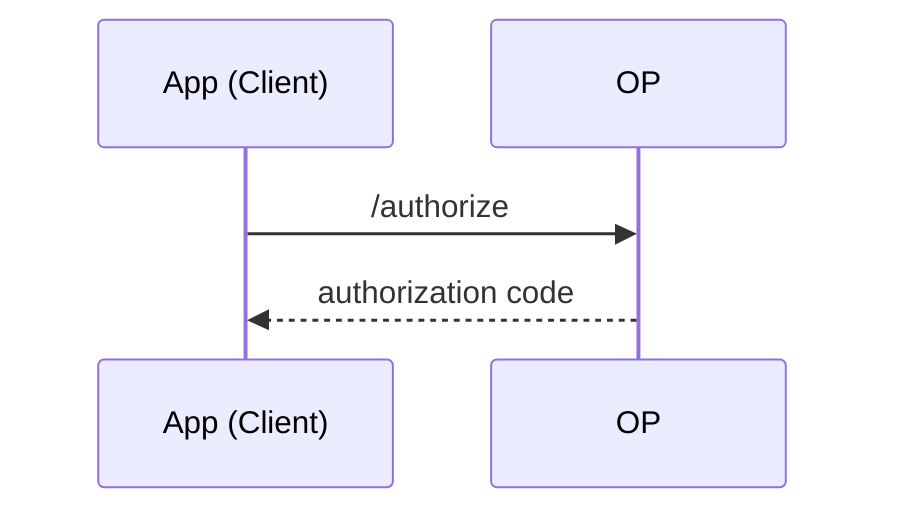

# 아티클 작성 가이드

이 문서는 블로그에 새 글을 추가하는 방법을 설명합니다. 어떤 폴더에 어떤 형식으로 작성하는지, 메타데이터(front-matter)는 어떻게 채우는지, 이미지는 어떻게 처리하는지를 다룹니다.

> 참고: 과거 `small_talk`(스몰토크) 콘텐츠 타입이 있었으나 현재는 제거되었고 원본은 `archive/small_talk/`에 보관되어 있습니다. 현재 작성 가능한 콘텐츠 타입은 **article** 하나입니다.

## 1. 어디에 작성하나

모든 아티클은 `content/article/<category>/` 아래에 마크다운(`.md`) 파일로 작성합니다.

```
content/article/
├── develop/
├── next/
├── react/
├── remix/
└── web/
```

- **카테고리(`<category>`)** 는 폴더 이름이 그대로 사용됩니다. 위 폴더들은 기존 카테고리이며, 새 카테고리가 필요하면 `content/article/` 아래에 폴더를 새로 만들면 됩니다.
- **파일 이름(slug)** 이 곧 URL 경로가 됩니다. 확장자 `.md`를 제외한 이름이 `path`로 쓰입니다.
  - 예) `content/article/react/react-redux-ecosystem.md` → `/article/react/react-redux-ecosystem`
- 파일 이름은 URL에 그대로 노출되므로 영문 소문자와 하이픈(`-`)을 사용하는 것을 권장합니다.

## 2. 파일 형식과 메타데이터

파일 최상단에 `---`로 감싼 YAML front-matter 블록을 두고, 그 아래에 본문을 마크다운으로 작성합니다.

```markdown
---
title: "Firebase로 Next 프로젝트 배포하기 : page router / next-auth / next-i18next"
description: This article provides a step-by-step guide for deploying a Next.js project to Firebase Hosting...
keywords: ["firebase", "hosting", "next-auth", "next-i18next"]
category: next
created_at: 2024-08-25 10:25
---

# 글 제목

본문 시작...
```

### 메타데이터 필드

| 필드          | 필수 | 타입     | 설명                                                                                 |
| ------------- | ---- | -------- | ------------------------------------------------------------------------------------ |
| `title`       | ✅   | string   | 글 제목. `<title>` 태그와 목록/상세 화면에 사용됩니다.                               |
| `description` | ✅   | string   | 글 요약. SEO meta description과 OG 태그에 사용됩니다. 검색 노출에 중요합니다.        |
| `keywords`    | ✅   | string[] | 키워드 배열. SEO 메타 키워드로 쓰이며, 상세 페이지에서 `category`와 함께 병합됩니다. |
| `category`    | ✅   | string   | 카테고리. **파일이 위치한 폴더 이름과 일치**시켜야 합니다.                           |
| `created_at`  | ✅   | datetime | 작성일시(`YYYY-MM-DD HH:mm`). 정렬 기준이자 예약 발행 판단 기준입니다.               |

> `title`에 콜론(`:`)이나 특수문자가 들어가면 YAML 파싱 오류가 날 수 있으므로 큰따옴표(`"`)로 감싸는 것을 권장합니다.

### 빌드 과정에서 자동으로 주입되는 필드

아래 필드는 front-matter에 직접 쓰지 않습니다. 콘텐츠 생성 파이프라인이 자동으로 채웁니다. (타입 정의는 루트 `content.d.ts` 참고)

- `index` — 생성 순서 인덱스
- `path` — 파일 이름에서 `.md`를 뺀 slug
- `readingTime` — `reading-time`으로 계산한 예상 읽기 시간 (예: `"3 min read"`)

## 3. 예약 발행 (created_at 기준)

프로덕션 빌드(`NODE_ENV === "production"`)에서는 `created_at`이 아직 도래하지 않은 글은 생성되지 않습니다. 즉 미래 시각을 `created_at`에 지정하면 그 시각 이후 배포부터 노출되는 예약 발행처럼 동작합니다.

- 판정 로직은 `script/function/validatePublicationDate.ts`에 있으며, `created_at`을 KST로 보고 UTC로 변환해(−9시간) 현재 UTC와 비교합니다.
- 로컬 개발(`yarn dev`)에서는 이 필터가 적용되지 않으므로 미래 날짜 글도 미리 확인할 수 있습니다.

## 4. 이미지 처리

### 저장 위치

이미지는 각 카테고리 폴더 아래 `image/<슬러그>/` 구조로 저장하는 것이 관례입니다.

```
content/article/react/
├── react-redux-ecosystem.md
└── image/
    └── react-redux-ecosystem/
        ├── flux-architecture.png
        └── 2024-redux-lib-transition.png
```

### 마크다운에서 참조하는 법

마크다운 파일 기준의 **상대 경로**로 참조합니다.

```markdown

```

### 동작 원리

빌드 시 `script/copyImageToPublic.ts`가 `content/` 아래의 모든 `.png`, `.jpg`, `.jpeg`를 동일한 하위 경로를 유지한 채 `public/`으로 복사합니다.

```
content/article/react/image/react-redux-ecosystem/flux-architecture.png
        └──────────────▼ (copyImageToPublic)
public/article/react/image/react-redux-ecosystem/flux-architecture.png
```

정적 서빙 기준(`public/`)으로 보면 위 이미지의 최종 URL은 `/article/react/image/react-redux-ecosystem/flux-architecture.png`가 됩니다. 마크다운의 상대 경로가 렌더링된 문서의 위치(`/article/<category>/<slug>`)를 기준으로 이 실제 파일 경로와 맞아떨어지도록 `image/<slug>/파일명` 관례를 지키는 것이 중요합니다.

> `public/article`은 `.gitignore` 대상입니다. 원본 이미지는 `content/`에만 커밋되고, `public/` 사본은 빌드 때마다 다시 생성됩니다.

- 지원 확장자: `png`, `jpg`, `jpeg`
- 새 이미지를 추가한 뒤에는 개발 서버를 재시작하거나 `yarn generate`를 실행해야 `public/`에 반영됩니다.

## 5. 콜아웃(Callout) 문법

커스텀 remark 플러그인(`script/function/remarkPlugins.ts`)이 `[!note]`로 시작하는 문단을 강조 콜아웃 박스로 변환합니다.

```markdown
[!note] 여기에 강조하고 싶은 내용을 작성합니다.
```

- 렌더링 시 `💡` 이모지가 붙은 `callout` 스타일 블록으로 변환됩니다.
- 문단 안에서 줄바꿈이 필요하면 `[break]` 토큰을 사용하면 개행으로 치환됩니다.

## 6. 다이어그램 (Mermaid)

코드 펜스에 `mermaid` 언어를 붙이면 시퀀스·플로우차트 등 [mermaid](https://mermaid.js.org/) 다이어그램을 그릴 수 있습니다.

````markdown

````

동작 방식과 유의점:

- **클라이언트에서 렌더링된다.** 빌드 파이프라인(`generateJsonContent`)은 mermaid를 처리하지 않는다. `rehype-highlight`는 `mermaid`를 모르는 언어로 보고 `<pre><code class="block language-mermaid">` 코드블록으로 그대로 통과시킨다. 실제 도형 변환은 아티클 상세 라우트의 클라이언트 전용 컴포넌트(`app/routes/article_.$category.$title/Mermaid.tsx`)가 담당한다. 이 컴포넌트가 `code.language-mermaid` 블록을 찾아 `mermaid.render()`로 SVG를 만들고 코드블록을 교체한다.
- **mermaid 번들은 필요할 때만 로드된다.** 페이지에 mermaid 블록이 하나라도 있을 때만 `import("mermaid")`가 실행되도록 되어 있어, 다이어그램이 없는 글에는 로딩 비용이 없다.
- **다크 테마로 그려진다.** 블로그 배경(`#2c2c2c`)에 맞춰 `theme: "dark"`로 초기화된다. 기본(라이트) 테마를 쓰면 글자·선이 배경에 묻힌다.
- **초기 깜빡임이 있다.** SSR 단계에서는 코드블록 텍스트로 보였다가, 클라이언트에서 SVG로 치환된다. (검색엔진/JS 비활성 환경에서는 다이어그램 원본 텍스트가 노출된다.)
- 렌더에 실패하면 원본 코드블록을 그대로 남긴다. 문법이 틀리면 도형 대신 mermaid 소스가 보이므로, 로컬 `yarn dev`로 확인한다.

## 7. 특수 인터랙티브 컴포넌트 (선택)

일부 글은 본문 하단에 지도/차트 같은 클라이언트 전용 인터랙티브 컴포넌트를 함께 렌더링합니다. 이 매핑은 `app/routes/article_.$category.$title/SpecificContent/index.tsx`의 `componentMap`에 **파일 슬러그(path)** 를 키로 등록되어 있습니다.

```ts
const componentMap = {
  "guidance-naver-map-and-drawing-manager": <NaverMap />,
  "x-axis-range-selector": <RangeSelector />,
};
```

- 일반 글에는 필요 없습니다. 등록된 슬러그가 아니면 아무것도 렌더링되지 않습니다.
- 새 인터랙티브 컴포넌트를 붙이려면 컴포넌트를 만들고 위 맵에 슬러그를 추가하면 됩니다.

## 8. 작성 후 확인

```bash
yarn dev
```

- 실행 전 `yarn generate`가 자동으로 돌며 마크다운을 JSON으로 변환합니다.
- `http://localhost:3000/articles`에서 목록을, `/article/<category>/<slug>`에서 상세를 확인합니다.
- 마크다운 원본을 수정하면 재생성이 필요하므로 개발 서버를 재시작하세요.

## 체크리스트

- [ ] `content/article/<category>/` 아래에 `.md` 생성 (파일명 = slug)
- [ ] front-matter에 `title`, `description`, `keywords`, `category`, `created_at` 작성
- [ ] `category` 값이 폴더명과 일치
- [ ] 이미지는 `image/<slug>/`에 두고 상대 경로로 참조
- [ ] `yarn dev`로 목록/상세/이미지 렌더링 확인
